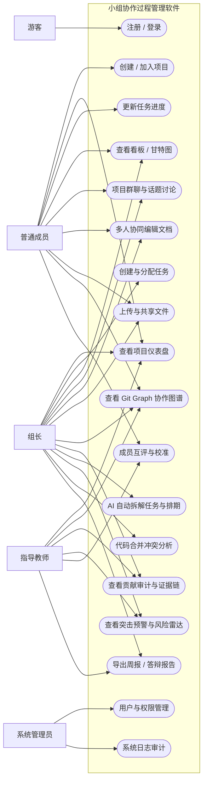
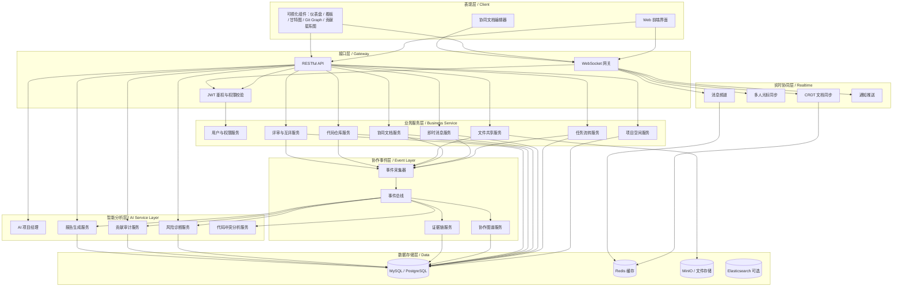
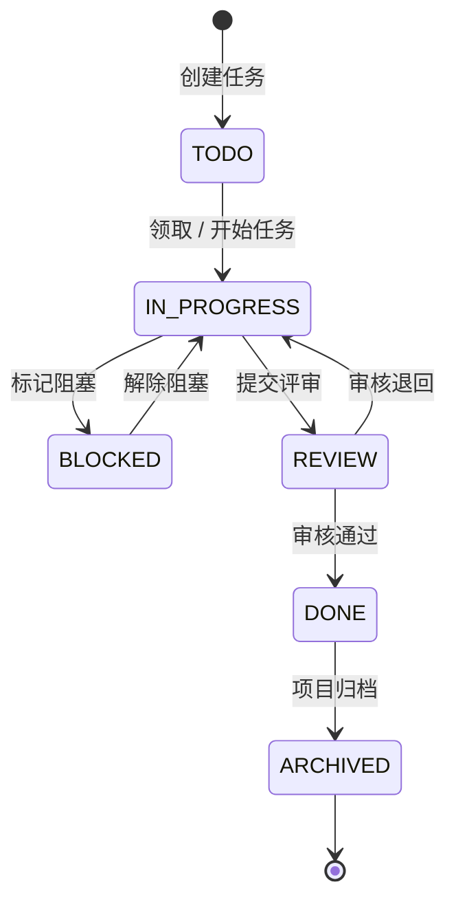
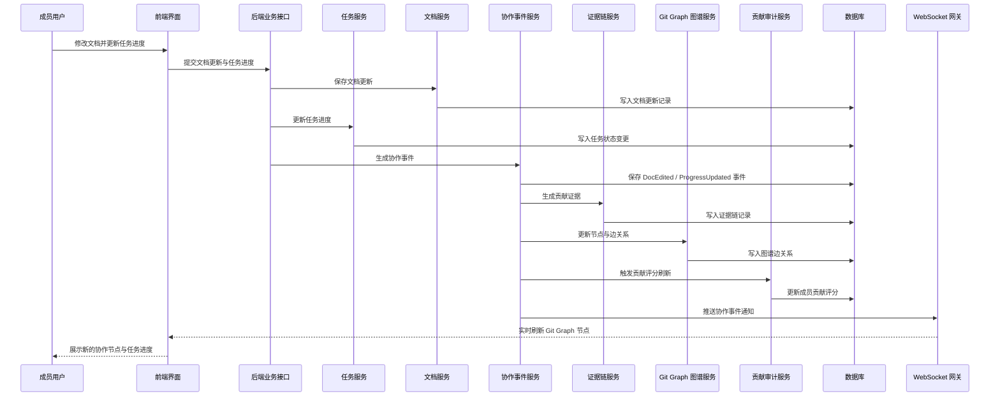
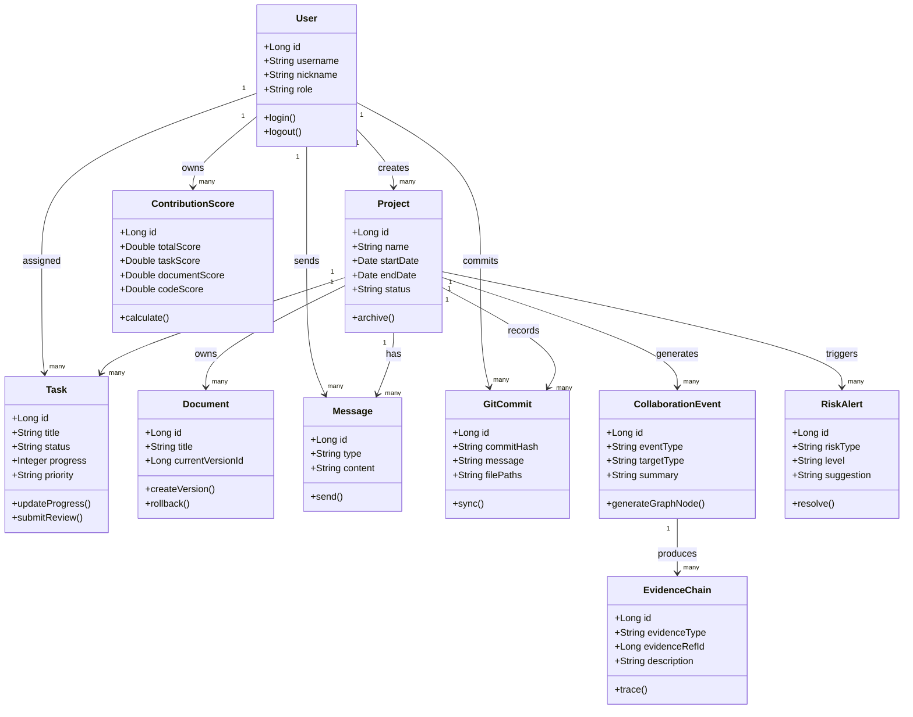
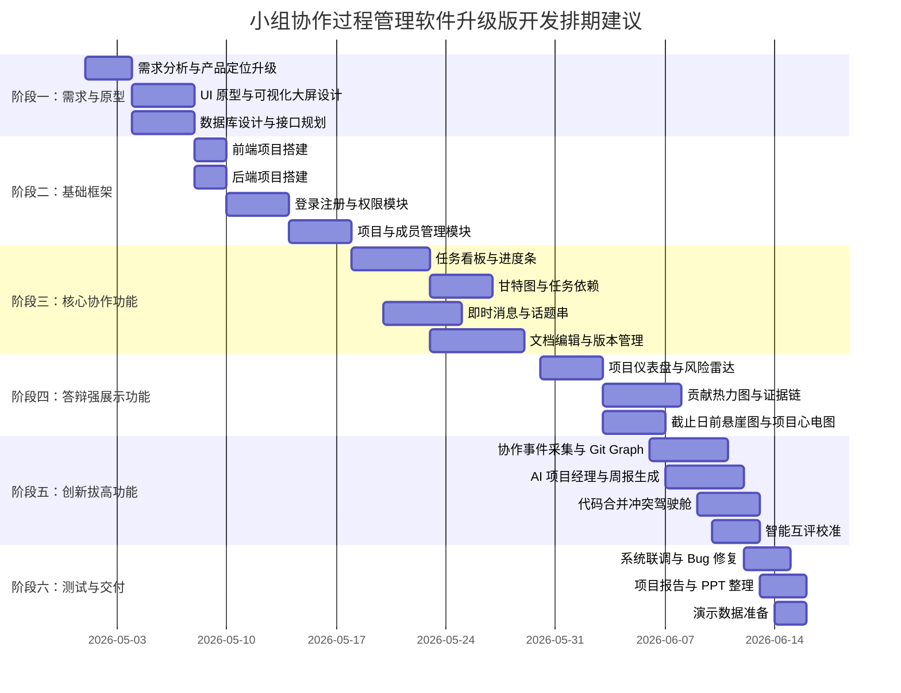

# 《小组协作过程管理软件》项目开发设计文档（升级版）

> 项目定位升级：本系统不再只是“任务管理 + 聊天 + 文档共享”的普通协作平台，而是面向大学课程设计场景的 **AI 驱动协作过程审计与智能项目管理平台**。系统通过任务、文档、代码、讨论、评审、互评等全过程数据采集，构建可追溯的协作证据链，使小组协作从“凭印象管理”升级为“凭过程证据管理”。

---

## 1. 项目概述与产品愿景

### 1.1 项目名称

**项目名称：小组协作过程管理软件**

建议产品名称：**TeamFlow Audit / 智协课设管家**

建议宣传语：

> **让每一次任务、文档、代码和讨论都有迹可循。**
> **让摸鱼、甩锅、突击提交和合并冲突无处隐藏。**
> **让教师评分从主观印象变成过程证据。**

### 1.2 项目背景

在大学软件工程课程设计、创新创业项目和团队课程作业中，小组协作经常存在以下真实问题：

1. **任务分配不清晰**：任务虽然写在群聊或文档中，但成员不清楚当前任务由谁负责、进展到哪里、是否存在延期风险。
2. **沟通和任务割裂**：需求讨论、任务安排、接口说明、Bug 反馈分散在微信群、QQ群、腾讯文档或本地文件中，后期难以追溯。
3. **文档协作不可追踪**：多人共同修改报告时，经常出现“谁改了什么、为什么改、改前是什么版本”不清楚的问题。
4. **代码协作容易冲突**：多人同时修改同一文件，接口定义频繁变化，最后合并代码时容易出现冲突、覆盖和责任不清。
5. **贡献评价不公平**：有人长期不参与，最后集中提交；有人刷消息、刷提交、刷格式化修改；也有人完成核心任务却在数量统计中不占优势。
6. **答辩缺少过程证据**：最终展示时只能展示系统页面，缺少任务推进、文档协作、代码提交、成员贡献等过程性证据。

因此，本项目的设计目标不是再做一个普通协作软件，而是构建一个真正贴合大学课设痛点的“协作过程管理 + 过程审计 + 智能分析 + 可视化评价”平台。

### 1.3 产品定位

本系统定位为：

> **面向大学课程设计场景的 AI 驱动协作过程审计与智能项目管理平台。**

系统以项目空间为核心，将任务、文档、消息、代码、文件、评审、互评和操作日志统一纳入项目上下文，并通过 AI 项目经理、Git Graph 协作图谱、贡献审计系统、证据链视图、风险预警雷达和答辩报告生成器，实现从“过程记录”到“过程诊断”再到“智能建议”的升级。

### 1.4 产品核心价值

#### 1.4.1 对普通成员的价值

- 清楚知道自己负责什么任务；
- 知道任务前置依赖和截止时间；
- 可以在任务下直接讨论、上传资料、关联文档；
- 自己的贡献会被系统自动记录，不怕被忽视；
- 能够通过证据链证明自己完成了哪些工作。

#### 1.4.2 对组长的价值

- 快速拆分任务并分配成员；
- 通过看板、甘特图和风险雷达掌握项目进度；
- 及时发现低活跃成员、任务阻塞和突击风险；
- 使用 AI 项目经理生成任务树、排期和周报；
- 通过贡献审计减少“摸鱼”和“甩锅”。

#### 1.4.3 对指导教师的价值

- 查看小组项目是否持续推进，而不是最后一天突击完成；
- 查看每位成员的真实贡献证据；
- 查看任务、文档、代码、讨论的全过程轨迹；
- 结合客观数据和互评校准结果进行过程性评价；
- 一键导出教师评分参考报告。

### 1.5 核心创新点

#### 1.5.1 创新点一：Git Graph 风格协作过程可视化

系统借鉴 Git / GitHub 的分支图和 Commit 历史，将任务创建、任务领取、进度更新、文档修改、消息讨论、文件上传、代码提交、评审通过等行为抽象为协作事件节点。不同成员或不同任务线形成类似 Git 分支的图结构，任务评审通过或文档合稿时形成 Merge 节点。

该设计使用户可以直观看到：

- 谁在什么时候做了什么；
- 某个任务从创建到完成经历了哪些阶段；
- 某份文档从初稿到终稿经历了哪些版本；
- 哪些贡献最终合并到了项目主线；
- 哪些任务分支长期悬挂、无人推进。

#### 1.5.2 创新点二：任务、沟通、文档、代码四位一体

系统不是将任务、聊天、文档和代码割裂成独立模块，而是建立统一的项目上下文：

- 任务可以绑定讨论串；
- 讨论可以引用任务、文档段落和代码提交；
- 文档修改可以关联任务和评审；
- 代码提交可以关联任务和 Bug；
- 每次关键行为都会写入协作事件图谱；
- 每个成员的贡献可以从任务、文档、代码、讨论、评审多个维度综合分析。

#### 1.5.3 创新点三：高颜值可视化协作大屏

系统通过仪表盘、动态环形图、Kanban 看板、Gantt 甘特图、Git Graph、贡献热力图、任务瓶颈雷达图、项目心电图、截止日前悬崖图等方式，将项目过程变成可视化、可解释、可答辩展示的动态数据故事。

#### 1.5.4 创新点四：AI 项目经理 Copilot

系统引入 AI 项目经理能力，能够根据项目主题、截止日期、成员角色和技术栈自动生成任务拆解、依赖关系、里程碑计划、每周交付物和风险提示。该功能使系统从传统协作记录工具升级为智能项目规划工具。

示例输入：

```text
我们要做一个小组协作过程管理软件，6 月 15 日提交，4 名成员，
一个负责前端，一个负责后端，一个负责数据库，一个负责文档。
```

系统自动生成：

- 项目里程碑；
- 一级任务与子任务；
- 任务依赖关系；
- 每个任务建议负责人；
- 每周交付物；
- 风险点；
- 推荐答辩演示路线；
- 甘特图初稿。

#### 1.5.5 创新点五：防摸鱼贡献审计与证据链评价

系统不再简单统计任务数量、消息数量或提交次数，而是基于任务完成质量、文档有效修改、代码贡献质量、评审通过率、响应速度、过程稳定性和同伴互评校准生成贡献得分，并为每一项得分提供可追溯证据链。

该功能重点解决大学课设中的典型问题：

- 有人挂名不干活；
- 有人最后一天集中提交；
- 有人刷消息、刷 commit、刷格式化修改；
- 有人完成核心任务却被低估；
- 组员互相甩锅，责任边界不清。

#### 1.5.6 创新点六：最后一天突击预警机制

系统通过分析成员活跃度、任务更新时间、文档版本增长、代码提交分布和协作事件密度，识别长期沉默与截止日前集中提交行为，生成 **Progress Debt Index（进度债务指数）**，帮助组长和教师判断项目是否存在突击完成风险。

#### 1.5.7 创新点七：代码合并冲突驾驶舱

系统面向软件工程课程设计中的代码协作痛点，提供 Git 仓库绑定、提交记录同步、Pull Request 状态追踪、文件修改热点、冲突风险预测和代码责任人分析。

示例提示：

```text
UserController.java 最近 24 小时被 3 名成员同时修改，且存在未合并分支，
冲突风险高。建议先由后端负责人冻结接口定义，再进行前端联调。
```

#### 1.5.8 创新点八：AI 周报与答辩报告自动生成

系统可以基于协作事件、任务完成情况、文档版本、代码提交和贡献证据，自动生成项目周报、个人贡献报告、延期原因报告、教师评价参考和答辩演示脚本，帮助小组在课程汇报时展示真实过程，而不只是展示最终页面。

### 1.6 视觉设计基调

系统采用“高级灰背景 + 低饱和科技蓝紫 + 数据可视化大屏”的现代 SaaS 风格。

设计关键词：

- **专业**：符合软件工程课程设计的系统化、规范化表达；
- **科技感**：Git Graph 节点连线、实时状态点、动态图谱；
- **高颜值**：圆角卡片、柔和阴影、清晰留白、低饱和渐变；
- **可解释**：每个数据指标都能点击查看证据；
- **答辩友好**：大屏页面适合直接用于 PPT 截图和现场演示。

---

## 2. 需求分析

### 2.1 总体需求描述

系统面向大学课程设计小组、创新创业项目小组和轻量级软件开发团队，提供从项目创建、成员管理、任务拆解、进度跟踪、即时沟通、文档协同、代码协作、文件共享、风险预警、贡献审计到答辩报告生成的全流程支持。

系统需要满足三类核心需求：

1. **基础协作需求**：项目空间、任务看板、文档编辑、消息沟通、文件共享；
2. **软件工程过程需求**：需求分析、任务依赖、状态流转、版本记录、代码提交、合并评审、数据库设计；
3. **课程评价需求**：过程证据、贡献审计、互评校准、突击预警、教师评分参考、答辩报告生成。

### 2.2 核心功能点拆解

#### 2.2.1 项目空间管理

项目空间是系统最高业务组织单位，一个项目空间对应一个课程设计小组或一个软件开发项目。

主要功能：

- 创建项目空间；
- 设置项目名称、简介、封面、项目周期；
- 邀请成员加入项目；
- 设置成员角色；
- 绑定课程、教师和答辩截止日期；
- 查看项目仪表盘；
- 管理项目任务、文档、消息、文件、代码仓库和协作图谱；
- 项目归档与过程报告导出。

#### 2.2.2 任务分配与看板管理

任务模块用于将项目目标拆解为可执行任务，并支持子任务、依赖、评审和进度追踪。

主要功能：

- 创建任务；
- 设置任务标题、描述、负责人、参与人、优先级、截止日期；
- 设置任务状态：待处理、进行中、阻塞中、待评审、已完成、已归档；
- 设置任务进度百分比；
- 拆解子任务和检查项；
- 设置任务依赖关系；
- 拖拽式 Kanban 看板；
- Gantt 甘特图时间排期；
- 任务延期提醒；
- 任务阻塞标记；
- 任务评审与退回；
- 任务绑定文档、讨论和代码提交；
- 任务变更自动生成协作事件节点。

#### 2.2.3 进度跟踪与项目仪表盘

项目仪表盘用于展示项目整体健康度。

主要功能：

- 项目总体完成率；
- 任务状态分布；
- 已完成任务数、进行中任务数、延期任务数；
- 成员任务负载；
- 成员贡献排名；
- 最近 7 天活跃度；
- 文档更新次数；
- 消息讨论热度；
- Git Graph 协作事件数量；
- 风险预警：延期风险、低活跃风险、任务阻塞风险、合并冲突风险、突击提交风险。

#### 2.2.4 即时通讯与讨论协作

系统内置类飞书/企业微信的 IM 沟通体验，避免项目讨论分散在外部聊天工具中。

主要功能：

- 项目群聊；
- 任务话题串 Thread；
- 文档段落评论；
- @ 成员提醒；
- 表情快捷回复；
- 代码片段高亮；
- 文件发送；
- 消息搜索；
- 消息与任务、文档、代码提交绑定；
- 消息已读未读状态；
- 关键消息置顶；
- 根据讨论一键生成任务。

#### 2.2.5 多人实时文档协同

文档模块对标飞书文档和微信文档，支持团队共同完成需求分析、系统设计、数据库设计、测试报告和答辩材料。

主要功能：

- 创建富文本协作文档；
- 多人实时编辑；
- 多人光标显示；
- 划词评论；
- 文档段落级讨论；
- 历史版本自动保存；
- 版本差异对比；
- 文档回滚；
- 文档权限控制；
- 文档修改生成协作事件节点；
- 文档导出为 Markdown、PDF 或 Word；
- 文档协作流向图展示成员内容如何进入最终报告。

#### 2.2.6 文件共享与资料管理

文件模块用于存储项目相关资源。

主要功能：

- 上传文件；
- 创建文件夹；
- 文件预览；
- 文件下载；
- 文件标签；
- 文件版本管理；
- 文件与任务绑定；
- 文件操作日志；
- 重要资料收藏；
- 文件被引用记录。

#### 2.2.7 Git Graph 协作过程可视化

系统将任务、文档、消息、代码提交、文件上传等行为统一记录为协作事件，并用 Git Graph 风格展示。

主要功能：

- 协作事件自动采集；
- 节点显示事件类型、成员头像、时间、摘要；
- 连线显示任务依赖、版本演进和贡献合并关系；
- 分支表示不同成员或不同任务线；
- 合并节点表示任务验收、文档合稿或代码合并；
- 节点点击查看详细操作记录；
- 时间范围筛选；
- 成员筛选；
- 任务筛选；
- 文档版本对比入口；
- 贡献统计联动。

#### 2.2.8 AI 智能项目经理模块

AI 智能项目经理模块用于解决组长不会拆任务、不会排期、不会发现风险的问题。

主要功能：

- 根据项目主题自动拆解任务；
- 自动生成任务依赖；
- 自动推荐负责人；
- 自动生成项目里程碑；
- 自动生成甘特图初稿；
- 根据成员角色生成分工建议；
- 根据延期风险给出调整建议；
- 支持一键生成周报和答辩报告。

#### 2.2.9 贡献审计与防摸鱼模块

贡献审计模块用于解决成员贡献不透明、评价不公平、过程证据不足的问题。

主要功能：

- 统计成员任务、文档、代码、讨论、评审贡献；
- 区分有效贡献与低质量刷量行为；
- 检测长期无操作成员；
- 检测最后阶段集中提交行为；
- 生成个人贡献证据链；
- 支持教师导出过程性评价报告；
- 提供贡献评分解释，说明每一分从何而来。

#### 2.2.10 代码协作与合并冲突预警模块

代码协作模块用于提升系统的软件工程特色。

主要功能：

- 支持绑定 Git 仓库或模拟 Git 提交；
- 展示成员代码提交记录；
- 展示 Pull Request 状态；
- 分析文件修改热点；
- 预测多人修改同一文件造成的冲突风险；
- 展示代码责任人；
- 支持代码评审记录；
- 代码提交与任务、Bug、讨论绑定。

#### 2.2.11 智能互评与教师审查模块

智能互评模块用于辅助教师进行公平评分。

主要功能：

- 成员进行匿名互评；
- 系统将互评分数与客观贡献数据对比；
- 发现异常高分、异常低分或互相刷分；
- 为教师提供最终评分建议；
- 导出个人贡献报告；
- 支持教师查看每个评分背后的过程证据。

#### 2.2.12 AI 周报与答辩报告生成模块

该模块用于解决课程设计最后阶段文档、PPT、答辩材料整理压力大的问题。

主要功能：

- 自动生成项目周报；
- 自动生成个人贡献报告；
- 自动生成风险分析报告；
- 自动生成任务完成报告；
- 自动生成答辩演示脚本；
- 自动生成教师评分参考表；
- 项目归档 PDF 导出。

### 2.3 角色权限划分

| 角色       | 主要职责                             | 核心权限                                                                                   |
| ---------- | ------------------------------------ | ------------------------------------------------------------------------------------------ |
| 游客       | 访问登录页、注册页                   | 注册、登录、查看公开介绍                                                                   |
| 普通成员   | 完成个人任务、参与讨论、编辑授权文档 | 查看项目、领取任务、更新进度、发送消息、编辑文档、上传文件、提交代码记录、参与互评         |
| 组长       | 管理项目计划和团队分工               | 创建项目、邀请成员、分配任务、审核任务、查看统计、管理文档权限、运行 AI 任务拆解、导出报告 |
| 指导教师   | 查看项目过程、评价团队贡献           | 查看项目仪表盘、查看任务进度、查看协作图谱、查看贡献证据链、查看互评校准、导出评分参考     |
| 系统管理员 | 维护系统运行                         | 用户管理、项目监管、系统配置、日志审计、数据备份                                           |

### 2.4 非功能性需求

#### 2.4.1 性能需求

- 普通页面接口响应时间应小于 500ms；
- 实时消息推送延迟应控制在 1 秒以内；
- 多人文档协同编辑操作同步延迟应控制在 300ms 到 800ms；
- 项目看板拖拽操作应保持流畅；
- Git Graph 在 1000 个协作事件以内应支持流畅渲染；
- 项目仪表盘应支持 3 秒内完成统计数据加载。

#### 2.4.2 可靠性需求

- 系统需要记录关键操作日志；
- 文档编辑需要自动保存；
- 任务状态变更需要保留历史记录；
- 协作事件生成需要与业务操作保持事务一致；
- 数据库定期备份；
- AI 生成内容需要支持人工确认后写入正式任务。

#### 2.4.3 安全性需求

- 用户密码加密存储；
- 登录使用 Token 鉴权；
- 接口层进行权限校验；
- 项目成员只能访问自己所在项目；
- 文档权限分为可读、可评论、可编辑、管理员；
- 防止越权访问、重复提交、恶意文件上传和 XSS 攻击；
- 教师评价数据和互评数据需要权限隔离。

#### 2.4.4 可维护性需求

- 前后端分离；
- 模块化设计；
- 接口遵循 RESTful 风格；
- 实时通信使用独立 WebSocket 网关；
- 业务服务按模块拆分；
- 关键业务逻辑有日志记录；
- 代码命名规范、注释清晰；
- 贡献评分和风险规则支持配置化调整。

### 2.5 附：系统整体用例图（Mermaid）

> 说明：Mermaid 原生没有专门的 UML Use Case 图语法，因此本文采用 Mermaid flowchart 按 UML 用例图语义建模，使用参与者、系统边界和用例节点表示整体用例关系；同时在后文补充类图、状态图和顺序图，以满足软件工程建模规范。



---

## 3. UI/UX 设计与可视化交互方案

### 3.1 整体视觉风格与色彩规范

系统采用现代 SaaS 产品界面风格，整体布局为“左侧导航 + 顶部状态栏 + 主内容区 + 右侧上下文面板”。

#### 3.1.1 布局结构

- **左侧导航栏**：项目切换、仪表盘、任务、文档、消息、文件、代码仓库、协作图谱、贡献审计、AI 项目经理、统计中心、设置。
- **顶部状态栏**：全局搜索、通知中心、快速新建按钮、在线成员头像、个人信息。
- **主内容区**：根据当前模块展示看板、甘特图、文档编辑器、聊天窗口、协作图谱或可视化大屏。
- **右侧上下文面板**：展示任务详情、成员动态、评论、版本记录、节点详情或贡献证据。

#### 3.1.2 色彩规范

| 用途     | 建议颜色       | 说明                                |
| -------- | -------------- | ----------------------------------- |
| 主色     | #4F46E5 靛蓝   | 用于主按钮、选中状态、关键节点      |
| 辅助色   | #06B6D4 青蓝   | 用于实时状态、协作光标、进度提示    |
| 成功色   | #22C55E 绿色   | 用于已完成任务、通过审核            |
| 警告色   | #F59E0B 琥珀色 | 用于延期风险、待确认状态            |
| 危险色   | #EF4444 红色   | 用于阻塞、失败、删除、冲突风险      |
| AI 色    | #8B5CF6 紫色   | 用于 AI Copilot、智能建议、自动报告 |
| 背景色   | #F8FAFC 浅灰   | 用于页面主背景                      |
| 卡片色   | #FFFFFF 白色   | 用于内容卡片                        |
| 文字主色 | #0F172A 深蓝灰 | 用于标题和正文                      |
| 文字弱色 | #64748B 灰蓝   | 用于说明文本                        |

### 3.2 首页仪表盘设计

首页仪表盘用于让用户快速理解项目现状。

#### 3.2.1 顶部核心指标卡片

1. **项目健康度**：综合任务进度、风险、活跃度、评审积压计算；
2. **项目完成率**：环形进度图展示整体完成百分比；
3. **进度债务指数**：显示是否存在长期拖延与最后突击风险；
4. **贡献可信度**：显示贡献数据是否稳定、是否存在刷量或异常互评。

#### 3.2.2 中部可视化区

- 左侧：项目心电图 Project ECG；
- 右侧：任务瓶颈雷达图 Bottleneck Radar；
- 下方：Git Graph 最新协作节点；
- 右下角：AI 项目经理智能建议。

#### 3.2.3 底部动态区

- 最近协作事件时间线；
- 今日待办任务；
- 最近更新文档；
- 热门讨论串；
- 高风险任务列表；
- 教师关注指标。

### 3.3 Git 可视化追踪面板设计

Git 可视化追踪面板是本系统最重要的创新界面之一。

#### 3.3.1 面板布局

面板由四部分组成：

1. **顶部筛选区**：按成员、任务、文档、代码文件、事件类型、时间范围筛选；
2. **左侧分支轨道区**：不同颜色的分支表示不同任务线、成员线或功能线；
3. **中间节点图谱区**：用节点和连线显示协作事件；
4. **右侧详情面板**：点击节点后展示事件详情、关联任务、关联文档、代码提交、评论和版本差异。

#### 3.3.2 节点设计

每个协作事件节点包含：

- 成员头像；
- 事件类型图标；
- 时间戳；
- 简短描述；
- 状态颜色；
- 关联对象编号；
- 是否计入贡献评分；
- 是否存在证据链。

节点类型示例：

| 节点类型        | 含义     | 示例说明                  |
| --------------- | -------- | ------------------------- |
| TaskCreated     | 任务创建 | 组长创建“数据库设计”任务  |
| TaskAssigned    | 任务分配 | 任务分配给成员 A          |
| ProgressUpdated | 进度更新 | 任务进度从 40% 更新到 70% |
| DocEdited       | 文档编辑 | 修改需求分析文档第 3 节   |
| CommentAdded    | 评论     | 对某段文字提出修改意见    |
| FileUploaded    | 文件上传 | 上传 ER 图草稿            |
| CodeCommitted   | 代码提交 | 提交登录模块代码          |
| ReviewPassed    | 审核通过 | 组长确认任务完成          |
| RiskAlerted     | 风险预警 | 系统识别任务延期风险      |
| Merged          | 合并     | 将成员贡献合并到项目主线  |

### 3.4 任务进度可视化设计

#### 3.4.1 Kanban 看板

看板分为六列：

- 待处理；
- 进行中；
- 阻塞中；
- 待评审；
- 已完成；
- 已归档。

任务卡片显示：

- 任务标题；
- 负责人头像；
- 优先级标签；
- 截止日期；
- 子任务完成数；
- 动态进度条；
- 关联文档数量；
- 关联代码提交数量；
- 评论数量；
- 是否阻塞；
- 风险等级。

#### 3.4.2 Gantt 甘特图

甘特图用于展示项目周期和任务依赖。

设计要点：

- 横轴为时间；
- 纵轴为任务列表；
- 每个任务用彩色条形表示；
- 条形长度表示任务开始和结束时间；
- 条形内部显示完成百分比；
- 依赖任务之间使用箭头连接；
- 延期任务使用警告色描边；
- 阻塞任务使用红色闪烁标记；
- AI 推荐排期用虚线展示。

### 3.5 可视化大屏矩阵设计

系统除传统仪表盘、看板和甘特图外，新增六类高冲击力可视化界面。

#### 3.5.1 团队贡献星系图 Contribution Galaxy

视觉形式：

- 每个成员是一个发光星球；
- 星球大小表示总贡献；
- 星球亮度表示近期活跃；
- 星球颜色表示主要贡献类型：前端、后端、文档、测试、管理；
- 任务围绕成员形成轨道；
- 已完成任务是实心点；
- 延期任务是红色警告点；
- 鼠标悬停显示贡献证据。

产品价值：教师一眼能看出谁是核心成员、谁边缘化、谁负责了关键模块。

#### 3.5.2 多层贡献热力图

展示方式：

- 每个成员一行；
- 每天一个格子；
- 格子内通过颜色深浅和小图标区分任务、文档、代码、讨论、评审、文件上传；
- 点击某一天格子，右侧弹出当天证据。

示例：

```text
2026-05-24 张三贡献详情：
- 完成任务：数据库表结构设计
- 修改文档：数据库设计章节 624 字
- 提交代码：3 次
- 参与讨论：5 条
- 评审通过：1 个任务
```

#### 3.5.3 文档协作动态流向图

视觉形式采用 Sankey 桑基图：

```text
张三 ── 需求分析 ── 项目报告
李四 ── 数据库设计 ── 项目报告
王五 ── 界面设计 ── 项目报告
赵六 ── 测试报告 ── 项目报告
```

线条越粗，表示贡献越大；线条颜色表示贡献类型。点击线条可以查看对应修改记录。

#### 3.5.4 任务瓶颈雷达图 Bottleneck Radar

维度包括：

- 进度延迟；
- 依赖阻塞；
- 任务负载不均；
- 评审积压；
- 代码冲突风险；
- 文档滞后；
- 低活跃风险。

雷达图中心显示：

```text
项目健康度：72 / 100
最大风险：接口联调阻塞、测试任务滞后
```

#### 3.5.5 项目心电图 Project ECG

横轴是时间，纵轴是团队活跃度，曲线像心电图一样跳动：

- 任务完成：绿色峰值；
- 文档更新：蓝色峰值；
- 代码提交：紫色峰值；
- 阻塞事件：红色尖峰；
- 长时间无操作：灰色平线；
- 教师检查点：金色标记。

产品表达：

> 项目不是静态任务表，而是有生命体征的协作系统。

#### 3.5.6 截止日前悬崖图 Deadline Cliff

展示方式：

- 横轴：距离截止日期还有多少天；
- 纵轴：累计完成度；
- 理想曲线：平稳上升；
- 实际曲线：真实进度；
- 若实际曲线长期低于理想曲线，背景变为橙色；
- 若最后 48 小时突然陡升，系统标记“突击提交风险”。

---

## 4. 系统架构与技术选型

### 4.1 总体架构思想

系统采用前后端分离、事件驱动、实时协同和智能分析相结合的架构。

整体分为：

- 表现层；
- 网关与接口层；
- 业务服务层；
- 实时协同层；
- 协作事件层；
- 智能分析层；
- 数据存储层；
- 基础设施层。

### 4.2 前端技术栈

| 技术                         | 用途         | 选择理由                           |
| ---------------------------- | ------------ | ---------------------------------- |
| Vue 3 / React                | 前端框架     | 组件化开发，适合复杂交互界面       |
| TypeScript                   | 类型约束     | 提高代码可靠性和可维护性           |
| Vite                         | 构建工具     | 启动快，开发体验好                 |
| Pinia / Zustand              | 状态管理     | 管理用户、项目、任务、消息状态     |
| Element Plus / Ant Design    | 基础组件库   | 快速实现表单、弹窗、菜单、看板     |
| ECharts                      | 数据可视化   | 实现环形图、雷达图、热力图、心电图 |
| G6 / React Flow              | 图可视化     | 实现 Git Graph 和证据链图谱        |
| TipTap / ProseMirror         | 富文本编辑器 | 支持协同编辑和扩展插件             |
| Monaco Editor / highlight.js | 代码高亮     | 支持代码片段和提交 diff 展示       |
| WebSocket 客户端             | 实时通信     | 支持消息、光标、协作事件实时同步   |

### 4.3 后端技术栈

| 技术                      | 用途           | 选择理由                                   |
| ------------------------- | -------------- | ------------------------------------------ |
| Spring Boot / NestJS      | 后端服务框架   | 结构清晰，适合工程化开发                   |
| Spring Security / JWT     | 认证授权       | 实现登录鉴权和接口权限控制                 |
| MySQL / PostgreSQL        | 关系型数据库   | 存储用户、任务、文档、消息等结构化数据     |
| Redis                     | 缓存与在线状态 | 存储在线用户、消息未读数、协同编辑临时状态 |
| WebSocket / Socket.IO     | 实时通信       | 支持 IM、协同光标、进度同步                |
| MinIO / 本地对象存储      | 文件存储       | 管理附件、报告导出文件和项目资源           |
| Elasticsearch 可选        | 全文检索       | 支持消息、文档和任务搜索                   |
| RabbitMQ / Kafka 可选     | 异步事件队列   | 处理协作事件、通知、统计计算               |
| 大模型 API / 本地规则引擎 | AI 服务        | 实现任务拆解、风险诊断和报告生成           |

### 4.4 实时协同算法选型

多人协同文档采用 **CRDT + Yjs + WebSocket** 方案。

理由：

- Yjs 与 TipTap、ProseMirror 生态兼容；
- 支持多人光标和实时编辑；
- 支持离线编辑后的合并；
- 可以将文档更新操作保存为版本快照；
- 便于将文档修改事件写入 Git Graph 协作图谱。

### 4.5 事件驱动架构设计

系统中的关键操作都被转换为协作事件，进入统一事件管道。

事件来源包括：

- 任务创建、分配、更新、评审；
- 文档编辑、评论、版本创建；
- 消息发送、@ 提及、讨论解决；
- 文件上传、文件引用；
- 代码提交、PR 创建、合并、冲突；
- 风险预警生成；
- 互评提交；
- AI 报告生成。

事件用途包括：

- 渲染 Git Graph；
- 计算成员贡献；
- 生成证据链；
- 识别风险；
- 生成周报和答辩报告；
- 支持教师过程评价。

### 4.6 智能分析层 / AI Service Layer

智能分析层负责对任务、文档、消息、代码和协作事件进行分析，提供任务拆解、风险预测、贡献评分、周报生成和答辩报告生成能力。

主要服务包括：

| 服务                             | 职责                                                 |
| -------------------------------- | ---------------------------------------------------- |
| AIPlanningService                | 智能任务拆解、里程碑生成、负责人推荐、甘特图初稿生成 |
| RiskAnalysisService              | 延期、阻塞、突击提交、低活跃、冲突风险检测           |
| ContributionAuditService         | 成员贡献评分、刷量检测、证据链生成                   |
| ReportGenerationService          | 项目周报、个人贡献报告、答辩脚本生成                 |
| GitAnalysisService               | 代码提交分析、文件热点、合并冲突风险分析             |
| PeerEvaluationCalibrationService | 互评分数异常检测与校准                               |

### 4.7 附：系统分层架构图（Mermaid）



---

## 5. 核心功能模块详细设计

### 5.1 即时沟通与协同模块

#### 5.1.1 模块目标

即时沟通模块用于提供项目内统一沟通入口，使成员讨论不再散落在外部群聊中，并且能够与任务、文档、代码提交和协作事件关联。

#### 5.1.2 功能结构

- 项目群聊；
- 任务讨论串；
- 文档段落评论；
- 代码提交讨论；
- 私信提醒；
- @ 提及；
- 表情回复；
- 代码片段；
- 文件消息；
- 消息搜索；
- 消息已读状态；
- 根据讨论生成任务。

#### 5.1.3 消息类型设计

| 消息类型   | 说明             | 示例                     |
| ---------- | ---------------- | ------------------------ |
| text       | 普通文本消息     | “我已经完成需求分析初稿” |
| mention    | @ 提及消息       | “@张三 请补充数据库设计” |
| file       | 文件消息         | 上传接口文档.pdf         |
| code       | 代码片段消息     | 分享登录接口代码         |
| task_ref   | 任务引用消息     | 引用任务 T-102           |
| doc_ref    | 文档引用消息     | 引用需求文档第 3 节      |
| commit_ref | 代码提交引用消息 | 引用 commit abc123       |
| system     | 系统消息         | “任务已被移动到待评审”   |
| reaction   | 表情回应         | 👍、✅、👀               |

#### 5.1.4 消息流转流程

1. 用户在项目群聊或任务讨论串中输入消息；
2. 前端通过 WebSocket 发送消息；
3. 消息服务校验用户是否属于该项目；
4. 消息写入数据库；
5. 系统识别 @ 成员、任务引用、文档引用和代码提交引用；
6. 通知服务向相关成员推送提醒；
7. 其他在线成员实时收到消息；
8. 如果消息绑定任务、文档或代码，则写入协作事件表；
9. 贡献审计模块判断该消息是否为有效协作行为。

### 5.2 多人实时文档模块

#### 5.2.1 模块目标

多人实时文档模块用于支持团队共同编辑项目报告、需求文档、设计文档、测试报告和答辩材料。系统需要保证多人同时编辑时内容一致、操作可追溯、版本可回滚。

#### 5.2.2 功能结构

- 文档创建；
- 文档目录管理；
- 富文本编辑；
- 多人实时光标；
- 协同编辑；
- 划词评论；
- 历史版本；
- 版本差异对比；
- 权限控制；
- 文档导出；
- 文档协作流向图。

#### 5.2.3 并发控制策略

本项目采用 CRDT 的最终一致性策略。每个用户的编辑操作被表示为可合并的数据更新。即使多个用户同时编辑相同文档，也可以通过 CRDT 机制自动合并，保证所有客户端最终获得一致内容。

具体策略：

- 每个文档对应唯一 doc_id；
- 每个协作客户端对应 client_id；
- 每次编辑产生 update；
- update 通过 WebSocket 广播；
- 服务端保存 update 日志和周期性快照；
- 客户端断线重连后拉取缺失 update；
- 文档版本保存为 snapshot；
- 版本对比通过快照差异计算实现；
- 重要修改写入协作事件表。

#### 5.2.4 文档版本管理

文档版本分为：

1. **自动版本**：系统每隔一定时间或达到修改量阈值自动生成；
2. **手动版本**：用户主动点击“保存为版本”；
3. **里程碑版本**：任务评审、阶段提交、项目归档时生成。

每个版本包含：

- 版本号；
- 创建时间；
- 创建人；
- 版本摘要；
- 文档快照；
- 关联任务；
- 关联协作事件；
- 有效新增字数；
- 有效修改段落。

### 5.3 任务流转与进度追踪模块

#### 5.3.1 模块目标

任务模块用于将项目目标拆分为可执行任务，并通过状态流转、进度条、看板和甘特图实现过程管理。

#### 5.3.2 任务状态机



#### 5.3.3 任务进度计算

任务进度可以由人工更新，也可以由子任务自动计算。

```text
主任务进度 = 已完成子任务权重之和 / 全部子任务权重之和 × 100%
```

如果任务包含代码提交、文档版本和评审记录，系统可根据关联证据辅助判断进度是否可信。例如，某任务进度手动填写为 90%，但没有任何文档修改、代码提交或讨论记录，系统会标记为“进度可信度低”。

#### 5.3.4 风险预警规则

| 风险类型     | 触发条件                         | 系统提示         |
| ------------ | -------------------------------- | ---------------- |
| 延期风险     | 当前时间超过计划进度 20%         | 任务可能延期     |
| 阻塞风险     | 任务被标记阻塞超过 24 小时       | 需要组长介入     |
| 低活跃风险   | 负责人 3 天无操作                | 成员近期未更新   |
| 依赖风险     | 前置任务延期导致后续任务无法启动 | 依赖链存在风险   |
| 评审风险     | 待评审状态超过 48 小时           | 需要及时审核     |
| 进度虚高风险 | 进度高但缺少证据事件             | 需要补充过程证据 |
| 突击提交风险 | 截止前 48 小时事件异常集中       | 存在最后突击风险 |

### 5.4 特色功能：协作过程可视化追踪实现原理

#### 5.4.1 设计目标

协作过程可视化模块将抽象的团队协作行为转化为可浏览、可过滤、可回溯、可评价的图结构。它不是简单操作日志，而是以时间为主轴、以任务或成员为分支、以事件为节点、以依赖和合并关系为边的过程图谱。

#### 5.4.2 协作事件抽象模型

| 字段                | 说明                                   |
| ------------------- | -------------------------------------- |
| event_id            | 事件 ID                                |
| project_id          | 所属项目                               |
| actor_id            | 操作人                                 |
| event_type          | 事件类型                               |
| target_type         | 目标类型：任务、文档、消息、文件、代码 |
| target_id           | 目标对象 ID                            |
| parent_event_id     | 父事件 ID                              |
| branch_name         | 分支名称                               |
| summary             | 事件摘要                               |
| payload             | 事件扩展数据 JSON                      |
| evidence_level      | 证据强度                               |
| contribution_weight | 贡献权重                               |
| created_at          | 创建时间                               |

#### 5.4.3 图谱生成逻辑

1. 用户执行关键操作；
2. 业务模块完成操作并提交事务；
3. 事件采集器生成协作事件；
4. 图谱服务根据 target_type 和 target_id 查找前置事件；
5. 系统建立当前事件与前置事件的边；
6. 如果任务进入评审通过状态，则生成 merge 节点；
7. 证据链服务为事件建立证据索引；
8. 前端请求图谱数据；
9. 前端使用 G6 或 React Flow 渲染 Git Graph。

#### 5.4.4 附：核心时序图（Mermaid）



### 5.5 AI 项目经理模块详细设计

#### 5.5.1 模块目标

AI 项目经理 Copilot 用于辅助组长进行任务拆解、进度排期、成员分工和风险识别。它的目标不是替代组长，而是为组长提供一个可编辑、可确认、可落地的项目计划初稿。

#### 5.5.2 功能结构

- 项目信息输入；
- 成员能力录入；
- AI 任务拆解；
- 里程碑生成；
- 任务依赖生成；
- 负责人推荐；
- 甘特图初稿生成；
- 风险点预测；
- 人工确认后写入正式任务表。

#### 5.5.3 业务流程

1. 组长输入项目主题、截止日期、成员数量、成员角色和技术栈；
2. 前端将信息提交给 AIPlanningService；
3. AIPlanningService 调用大模型 API 或本地规则引擎；
4. 系统返回结构化 JSON，包括任务树、里程碑、依赖关系、负责人建议；
5. 组长在页面中修改和确认；
6. 确认后写入 task、task_dependency、milestone 表；
7. 系统自动生成协作事件和甘特图。

#### 5.5.4 结构化输出示例

```json
{
  "milestones": [
    { "name": "需求分析完成", "dueDate": "2026-05-10" },
    { "name": "系统设计完成", "dueDate": "2026-05-20" },
    { "name": "功能开发完成", "dueDate": "2026-06-05" }
  ],
  "tasks": [
    {
      "title": "完成需求分析文档",
      "assigneeRole": "文档负责人",
      "priority": "high",
      "dependsOn": [],
      "subtasks": ["用户角色分析", "功能需求描述", "用例图绘制"]
    }
  ],
  "risks": ["前后端联调时间不足", "数据库设计需提前冻结"]
}
```

#### 5.5.5 页面设计

AI 项目经理页面采用三栏布局：

- 左侧：项目信息输入区；
- 中间：AI 生成任务树；
- 右侧：里程碑、依赖关系和风险建议；
- 底部：一键生成甘特图、一键写入任务、一键生成周报。

#### 5.5.6 接口设计

| 接口                          | 方法 | 说明                 |
| ----------------------------- | ---- | -------------------- |
| /api/ai/planning              | POST | 生成项目任务拆解建议 |
| /api/ai/planning/{id}/confirm | POST | 确认并写入正式任务   |
| /api/ai/risks                 | POST | 生成项目风险建议     |
| /api/ai/reports/weekly        | POST | 生成项目周报         |

### 5.6 贡献审计与防摸鱼模块详细设计

#### 5.6.1 模块目标

贡献审计模块用于回答三个关键问题：

1. 谁真正推动了项目？
2. 谁只是最后补交、刷存在感？
3. 哪些贡献有证据、能被教师核查？

#### 5.6.2 贡献评分模型

| 指标         | 权重建议 | 说明                                                 |
| ------------ | -------: | ---------------------------------------------------- |
| 任务完成质量 |      30% | 任务是否按时完成，是否一次评审通过，任务难度如何     |
| 文档有效贡献 |      20% | 统计有效新增、修改、被采纳内容，不统计无意义空格修改 |
| 代码贡献质量 |      20% | 统计提交、PR、代码评审通过率、冲突率和核心文件贡献   |
| 协作响应能力 |      15% | 被 @ 后响应时间、阻塞问题处理速度、讨论有效性        |
| 过程稳定性   |      10% | 是否长期稳定推进，而非最后突击                       |
| 同伴互评校准 |       5% | 与客观行为数据结合修正                               |

贡献总分计算：

```text
贡献总分 = 任务完成质量 × 30%
        + 文档有效贡献 × 20%
        + 代码贡献质量 × 20%
        + 协作响应能力 × 15%
        + 过程稳定性 × 10%
        + 同伴互评校准 × 5%
```

#### 5.6.3 防刷量规则

| 刷量行为 | 识别规则                     | 处理方式         |
| -------- | ---------------------------- | ---------------- |
| 刷消息   | 短时间发送大量低信息量消息   | 降低消息贡献权重 |
| 刷提交   | 多次提交格式化或无实质 diff  | 标记为低质量提交 |
| 刷文档   | 只修改空格、标点、格式       | 不计入有效字数   |
| 最后突击 | 截止前短时间集中提交大量事件 | 计入进度债务指数 |
| 互相刷分 | 互评分数明显高于客观贡献     | 提醒教师复核     |

#### 5.6.4 证据链设计

每一项贡献得分必须能追溯到具体证据。

证据类型包括：

- 任务完成记录；
- 任务评审通过记录；
- 文档版本 diff；
- 文档评论被采纳记录；
- 代码 commit；
- Pull Request；
- 代码评审记录；
- 讨论消息；
- 文件上传；
- 风险处理记录。

任务证据链示例：

```text
需求提出 → 任务创建 → 指派负责人 → 讨论确认 → 文档修改 → 代码提交 → 评审反馈 → 修改完成 → 合并归档
```

#### 5.6.5 页面设计

贡献审计页面包括：

- 成员贡献总览卡片；
- 贡献雷达图；
- 多层贡献热力图；
- 贡献证据链列表；
- 异常贡献提示；
- 教师评分参考；
- 一键导出个人贡献报告。

### 5.7 代码合并冲突预警模块详细设计

#### 5.7.1 模块目标

代码合并冲突预警模块用于解决软件工程课程设计中的代码协作问题，包括多人修改同一文件、接口定义不一致、Pull Request 积压和合并责任不清。

#### 5.7.2 功能结构

- Git 仓库绑定；
- Commit 记录同步或手动录入；
- Pull Request 状态展示；
- 文件修改热点图；
- 冲突风险预测；
- 代码责任人识别；
- 评审人推荐；
- 代码提交与任务绑定。

#### 5.7.3 冲突风险规则

| 风险行为         | 系统识别方式                             | 风险等级 |
| ---------------- | ---------------------------------------- | -------- |
| 多人修改同一文件 | 同一文件 24 小时内被 2 人以上修改        | 中       |
| 核心文件频繁变更 | controller、service、schema 文件频繁修改 | 高       |
| 长期未合并分支   | 分支超过 3 天未合并主线                  | 中       |
| PR 积压          | PR 超过 48 小时未评审                    | 中       |
| 接口文件冲突     | API 文档和后端代码字段不一致             | 高       |
| 临近截止大量提交 | 截止前 24 小时 commit 激增               | 高       |

#### 5.7.4 页面设计

代码合并冲突驾驶舱包括：

- 仓库概览卡片；
- 提交趋势图；
- 文件修改热点图；
- Pull Request 列表；
- 冲突风险列表；
- 代码责任人矩阵；
- 高风险文件详情。

### 5.8 智能互评与教师审查模块详细设计

#### 5.8.1 模块目标

智能互评模块用于解决传统互评中的人情分、互相给高分、恶意低分和评分缺少证据的问题。

#### 5.8.2 互评流程

1. 项目阶段结束后，组长或教师开启互评；
2. 每位成员对其他成员进行匿名评分；
3. 系统计算互评均分；
4. 系统将互评结果与客观贡献得分对比；
5. 对异常评分进行标记；
6. 教师查看互评解释和证据链；
7. 系统生成最终评分建议。

#### 5.8.3 异常互评识别

| 异常类型       | 判断方式                         |
| -------------- | -------------------------------- |
| 互相刷高分     | 两名成员互评显著高于其他成员评分 |
| 恶意低分       | 某成员给他人评分明显低于组内平均 |
| 人情分         | 全组互评分数高度集中且缺少区分度 |
| 与客观贡献冲突 | 互评分数与贡献审计得分差距过大   |

### 5.9 AI 周报与答辩报告生成模块详细设计

#### 5.9.1 模块目标

该模块根据任务、文档、代码、消息、风险和贡献数据，自动生成适合课程汇报和项目归档的报告。

#### 5.9.2 报告类型

- 项目日报；
- 项目周报；
- 阶段总结报告；
- 个人贡献报告；
- 风险分析报告；
- 答辩演示脚本；
- 教师评分参考表；
- 项目归档报告。

#### 5.9.3 周报生成内容示例

```text
本周完成任务：
1. 张三完成数据库 ER 图设计，并通过组长评审。
2. 李四完成登录注册接口开发，存在一次评审退回。
3. 王五完成需求分析文档第 2、3 节修改。

当前风险：
1. 前端页面开发进度落后计划 18%。
2. 接口联调任务依赖后端返回字段确认。
3. 测试报告尚未创建。

下周建议：
1. 优先完成接口冻结。
2. 将测试任务拆分为功能测试、接口测试、界面测试。
```

### 5.10 附：核心类图（Mermaid）



---

## 6. 数据库设计

### 6.1 数据库设计原则

- 用户、项目、任务、文档、消息、代码、文件和事件分表存储；
- 核心业务表使用逻辑删除；
- 所有关键表包含 created_at、updated_at 字段；
- 多对多关系使用中间表；
- 协作事件采用统一事件表；
- 文档内容与文档元信息分离；
- 大文件不直接存入数据库，而是存入对象存储，数据库保存文件路径；
- 贡献评分和风险预警独立建表，方便教师审查；
- AI 生成内容需要保存历史，方便回溯和人工确认。

### 6.2 核心业务表结构描述

#### 6.2.1 用户表 user

| 字段名        | 类型     | 说明             |
| ------------- | -------- | ---------------- |
| id            | bigint   | 用户 ID          |
| username      | varchar  | 用户名           |
| password_hash | varchar  | 加密密码         |
| nickname      | varchar  | 昵称             |
| avatar_url    | varchar  | 头像地址         |
| email         | varchar  | 邮箱             |
| phone         | varchar  | 手机号           |
| role          | varchar  | 系统角色         |
| status        | tinyint  | 状态：正常、禁用 |
| created_at    | datetime | 创建时间         |
| updated_at    | datetime | 更新时间         |

#### 6.2.2 项目表 project

| 字段名      | 类型     | 说明         |
| ----------- | -------- | ------------ |
| id          | bigint   | 项目 ID      |
| name        | varchar  | 项目名称     |
| description | text     | 项目简介     |
| cover_url   | varchar  | 项目封面     |
| owner_id    | bigint   | 创建人 ID    |
| course_name | varchar  | 课程名称     |
| teacher_id  | bigint   | 指导教师 ID  |
| start_date  | date     | 开始日期     |
| end_date    | date     | 结束日期     |
| deadline    | datetime | 最终提交时间 |
| status      | varchar  | 项目状态     |
| created_at  | datetime | 创建时间     |
| updated_at  | datetime | 更新时间     |

#### 6.2.3 项目成员表 project_member

| 字段名     | 类型     | 说明                       |
| ---------- | -------- | -------------------------- |
| id         | bigint   | 主键 ID                    |
| project_id | bigint   | 项目 ID                    |
| user_id    | bigint   | 用户 ID                    |
| role       | varchar  | 项目角色：组长、成员、教师 |
| skill_tags | varchar  | 技能标签                   |
| joined_at  | datetime | 加入时间                   |
| status     | varchar  | 成员状态                   |

#### 6.2.4 任务表 task

| 字段名              | 类型     | 说明       |
| ------------------- | -------- | ---------- |
| id                  | bigint   | 任务 ID    |
| project_id          | bigint   | 所属项目   |
| parent_id           | bigint   | 父任务 ID  |
| title               | varchar  | 任务标题   |
| description         | text     | 任务描述   |
| assignee_id         | bigint   | 负责人     |
| creator_id          | bigint   | 创建人     |
| priority            | varchar  | 优先级     |
| difficulty          | int      | 任务难度   |
| status              | varchar  | 任务状态   |
| progress            | int      | 进度百分比 |
| progress_confidence | int      | 进度可信度 |
| start_time          | datetime | 开始时间   |
| due_time            | datetime | 截止时间   |
| completed_at        | datetime | 完成时间   |
| created_at          | datetime | 创建时间   |
| updated_at          | datetime | 更新时间   |

#### 6.2.5 任务依赖表 task_dependency

| 字段名             | 类型     | 说明        |
| ------------------ | -------- | ----------- |
| id                 | bigint   | 主键 ID     |
| task_id            | bigint   | 当前任务 ID |
| depends_on_task_id | bigint   | 前置任务 ID |
| dependency_type    | varchar  | 依赖类型    |
| created_at         | datetime | 创建时间    |

#### 6.2.6 里程碑表 milestone

| 字段名        | 类型     | 说明           |
| ------------- | -------- | -------------- |
| id            | bigint   | 里程碑 ID      |
| project_id    | bigint   | 项目 ID        |
| name          | varchar  | 里程碑名称     |
| description   | text     | 说明           |
| due_date      | date     | 截止日期       |
| status        | varchar  | 状态           |
| created_by_ai | boolean  | 是否由 AI 生成 |
| created_at    | datetime | 创建时间       |

#### 6.2.7 文档表 document

| 字段名             | 类型     | 说明        |
| ------------------ | -------- | ----------- |
| id                 | bigint   | 文档 ID     |
| project_id         | bigint   | 所属项目    |
| title              | varchar  | 文档标题    |
| creator_id         | bigint   | 创建人      |
| current_version_id | bigint   | 当前版本 ID |
| permission         | varchar  | 文档权限    |
| created_at         | datetime | 创建时间    |
| updated_at         | datetime | 更新时间    |

#### 6.2.8 文档版本表 document_version

| 字段名               | 类型     | 说明         |
| -------------------- | -------- | ------------ |
| id                   | bigint   | 版本 ID      |
| document_id          | bigint   | 文档 ID      |
| version_no           | varchar  | 版本号       |
| snapshot             | longtext | 文档快照     |
| diff_summary         | text     | 差异摘要     |
| valid_added_words    | int      | 有效新增字数 |
| valid_modified_words | int      | 有效修改字数 |
| summary              | varchar  | 版本说明     |
| creator_id           | bigint   | 创建人       |
| created_at           | datetime | 创建时间     |

#### 6.2.9 消息表 message

| 字段名        | 类型     | 说明           |
| ------------- | -------- | -------------- |
| id            | bigint   | 消息 ID        |
| project_id    | bigint   | 项目 ID        |
| thread_id     | bigint   | 话题串 ID      |
| sender_id     | bigint   | 发送人         |
| message_type  | varchar  | 消息类型       |
| content       | text     | 消息内容       |
| ref_type      | varchar  | 引用对象类型   |
| ref_id        | bigint   | 引用对象 ID    |
| quality_score | int      | 消息有效性评分 |
| created_at    | datetime | 创建时间       |

#### 6.2.10 文件表 file_resource

| 字段名          | 类型     | 说明     |
| --------------- | -------- | -------- |
| id              | bigint   | 文件 ID  |
| project_id      | bigint   | 项目 ID  |
| uploader_id     | bigint   | 上传人   |
| file_name       | varchar  | 文件名   |
| file_url        | varchar  | 文件路径 |
| file_type       | varchar  | 文件类型 |
| file_size       | bigint   | 文件大小 |
| related_task_id | bigint   | 关联任务 |
| created_at      | datetime | 上传时间 |

#### 6.2.11 Git 仓库表 git_repository

| 字段名         | 类型     | 说明                    |
| -------------- | -------- | ----------------------- |
| id             | bigint   | 仓库 ID                 |
| project_id     | bigint   | 项目 ID                 |
| repo_name      | varchar  | 仓库名称                |
| repo_url       | varchar  | 仓库地址                |
| provider       | varchar  | GitHub、Gitee、本地模拟 |
| default_branch | varchar  | 默认分支                |
| sync_status    | varchar  | 同步状态                |
| created_at     | datetime | 创建时间                |

#### 6.2.12 Git 提交表 git_commit

| 字段名         | 类型     | 说明         |
| -------------- | -------- | ------------ |
| id             | bigint   | 提交 ID      |
| repository_id  | bigint   | 仓库 ID      |
| project_id     | bigint   | 项目 ID      |
| author_id      | bigint   | 作者 ID      |
| commit_hash    | varchar  | commit hash  |
| commit_message | varchar  | 提交说明     |
| branch_name    | varchar  | 分支名称     |
| changed_files  | text     | 修改文件列表 |
| added_lines    | int      | 新增行数     |
| deleted_lines  | int      | 删除行数     |
| quality_score  | int      | 提交质量评分 |
| commit_time    | datetime | 提交时间     |

#### 6.2.13 Pull Request 表 pull_request

| 字段名        | 类型     | 说明                 |
| ------------- | -------- | -------------------- |
| id            | bigint   | PR ID                |
| repository_id | bigint   | 仓库 ID              |
| project_id    | bigint   | 项目 ID              |
| creator_id    | bigint   | 创建人               |
| title         | varchar  | PR 标题              |
| source_branch | varchar  | 源分支               |
| target_branch | varchar  | 目标分支             |
| status        | varchar  | open、merged、closed |
| reviewer_id   | bigint   | 评审人               |
| created_at    | datetime | 创建时间             |
| merged_at     | datetime | 合并时间             |

#### 6.2.14 合并冲突风险表 merge_conflict_risk

| 字段名        | 类型     | 说明           |
| ------------- | -------- | -------------- |
| id            | bigint   | 风险 ID        |
| project_id    | bigint   | 项目 ID        |
| repository_id | bigint   | 仓库 ID        |
| file_path     | varchar  | 高风险文件路径 |
| risk_level    | varchar  | 风险等级       |
| reason        | text     | 风险原因       |
| suggestion    | text     | 处理建议       |
| status        | varchar  | 未处理、已处理 |
| created_at    | datetime | 创建时间       |

#### 6.2.15 协作事件表 collaboration_event

| 字段名              | 类型     | 说明         |
| ------------------- | -------- | ------------ |
| id                  | bigint   | 事件 ID      |
| project_id          | bigint   | 项目 ID      |
| actor_id            | bigint   | 操作人       |
| event_type          | varchar  | 事件类型     |
| target_type         | varchar  | 目标对象类型 |
| target_id           | bigint   | 目标对象 ID  |
| parent_event_id     | bigint   | 父事件 ID    |
| branch_name         | varchar  | 分支名称     |
| summary             | varchar  | 事件摘要     |
| payload             | json     | 扩展数据     |
| evidence_level      | varchar  | 证据强度     |
| contribution_weight | decimal  | 贡献权重     |
| created_at          | datetime | 创建时间     |

#### 6.2.16 贡献评分表 contribution_score

| 字段名          | 类型     | 说明       |
| --------------- | -------- | ---------- |
| id              | bigint   | 评分 ID    |
| project_id      | bigint   | 项目 ID    |
| user_id         | bigint   | 用户 ID    |
| task_score      | decimal  | 任务贡献分 |
| document_score  | decimal  | 文档贡献分 |
| code_score      | decimal  | 代码贡献分 |
| response_score  | decimal  | 响应协作分 |
| stability_score | decimal  | 过程稳定分 |
| peer_score      | decimal  | 互评校准分 |
| total_score     | decimal  | 总贡献分   |
| calculated_at   | datetime | 计算时间   |

#### 6.2.17 贡献证据表 contribution_evidence

| 字段名             | 类型     | 说明                                   |
| ------------------ | -------- | -------------------------------------- |
| id                 | bigint   | 证据 ID                                |
| project_id         | bigint   | 项目 ID                                |
| user_id            | bigint   | 用户 ID                                |
| score_id           | bigint   | 关联贡献评分 ID                        |
| evidence_type      | varchar  | 证据类型：任务、文档、代码、消息、评审 |
| evidence_ref_id    | bigint   | 证据对象 ID                            |
| contribution_value | decimal  | 贡献值                                 |
| description        | text     | 证据说明                               |
| created_at         | datetime | 创建时间                               |

#### 6.2.18 风险预警表 risk_alert

| 字段名      | 类型     | 说明                   |
| ----------- | -------- | ---------------------- |
| id          | bigint   | 风险 ID                |
| project_id  | bigint   | 项目 ID                |
| user_id     | bigint   | 相关用户，可为空       |
| target_type | varchar  | 风险对象类型           |
| target_id   | bigint   | 风险对象 ID            |
| risk_type   | varchar  | 风险类型               |
| risk_level  | varchar  | 风险等级               |
| risk_score  | int      | 风险分数               |
| reason      | text     | 风险原因               |
| suggestion  | text     | 处理建议               |
| status      | varchar  | 未处理、处理中、已解决 |
| created_at  | datetime | 创建时间               |

#### 6.2.19 AI 任务建议表 ai_task_suggestion

| 字段名       | 类型     | 说明                   |
| ------------ | -------- | ---------------------- |
| id           | bigint   | 建议 ID                |
| project_id   | bigint   | 项目 ID                |
| requester_id | bigint   | 请求人                 |
| input_prompt | text     | 用户输入               |
| output_json  | json     | AI 输出结构化结果      |
| status       | varchar  | 待确认、已采纳、已废弃 |
| created_at   | datetime | 创建时间               |

#### 6.2.20 成员互评表 peer_evaluation

| 字段名       | 类型     | 说明     |
| ------------ | -------- | -------- |
| id           | bigint   | 互评 ID  |
| project_id   | bigint   | 项目 ID  |
| evaluator_id | bigint   | 评价人   |
| evaluatee_id | bigint   | 被评价人 |
| score        | int      | 互评分数 |
| comment      | text     | 评价说明 |
| anomaly_flag | boolean  | 是否异常 |
| created_at   | datetime | 创建时间 |

#### 6.2.21 AI 报告历史表 ai_report_history

| 字段名       | 类型     | 说明                     |
| ------------ | -------- | ------------------------ |
| id           | bigint   | 报告 ID                  |
| project_id   | bigint   | 项目 ID                  |
| report_type  | varchar  | 周报、答辩报告、贡献报告 |
| generated_by | bigint   | 生成人                   |
| content      | longtext | 报告内容                 |
| file_url     | varchar  | 导出文件地址             |
| created_at   | datetime | 创建时间                 |

### 6.3 附：核心实体关系 E-R 图（Mermaid）

```mermaid
erDiagram
    USER ||--o{ PROJECT_MEMBER : joins
    PROJECT ||--o{ PROJECT_MEMBER : contains
    USER ||--o{ PROJECT : creates
    PROJECT ||--o{ TASK : has
    TASK ||--o{ TASK : contains_subtask
    TASK ||--o{ TASK_DEPENDENCY : has_dependency
    PROJECT ||--o{ MILESTONE : has
    PROJECT ||--o{ DOCUMENT : owns
    DOCUMENT ||--o{ DOCUMENT_VERSION : has_versions
    PROJECT ||--o{ MESSAGE : has_messages
    PROJECT ||--o{ FILE_RESOURCE : has_files
    PROJECT ||--o{ GIT_REPOSITORY : binds
    GIT_REPOSITORY ||--o{ GIT_COMMIT : has_commits
    GIT_REPOSITORY ||--o{ PULL_REQUEST : has_prs
    PROJECT ||--o{ MERGE_CONFLICT_RISK : has_conflict_risks
    PROJECT ||--o{ COLLABORATION_EVENT : records
    COLLABORATION_EVENT ||--o{ CONTRIBUTION_EVIDENCE : produces
    USER ||--o{ CONTRIBUTION_SCORE : owns_score
    USER ||--o{ CONTRIBUTION_EVIDENCE : owns_evidence
    PROJECT ||--o{ RISK_ALERT : triggers
    PROJECT ||--o{ AI_TASK_SUGGESTION : generates
    PROJECT ||--o{ PEER_EVALUATION : has_peer_reviews
    PROJECT ||--o{ AI_REPORT_HISTORY : has_reports

    USER {
        bigint id PK
        varchar username
        varchar nickname
        varchar role
        tinyint status
    }

    PROJECT {
        bigint id PK
        varchar name
        bigint owner_id FK
        bigint teacher_id FK
        datetime deadline
        varchar status
    }

    PROJECT_MEMBER {
        bigint id PK
        bigint project_id FK
        bigint user_id FK
        varchar role
        varchar skill_tags
    }

    TASK {
        bigint id PK
        bigint project_id FK
        bigint parent_id FK
        varchar title
        bigint assignee_id FK
        int difficulty
        varchar status
        int progress
        int progress_confidence
    }

    TASK_DEPENDENCY {
        bigint id PK
        bigint task_id FK
        bigint depends_on_task_id FK
        varchar dependency_type
    }

    MILESTONE {
        bigint id PK
        bigint project_id FK
        varchar name
        date due_date
        varchar status
    }

    DOCUMENT {
        bigint id PK
        bigint project_id FK
        varchar title
        bigint creator_id FK
        bigint current_version_id FK
    }

    DOCUMENT_VERSION {
        bigint id PK
        bigint document_id FK
        varchar version_no
        longtext snapshot
        int valid_added_words
        int valid_modified_words
    }

    MESSAGE {
        bigint id PK
        bigint project_id FK
        bigint sender_id FK
        varchar message_type
        text content
        int quality_score
    }

    FILE_RESOURCE {
        bigint id PK
        bigint project_id FK
        bigint uploader_id FK
        varchar file_name
        varchar file_url
        bigint related_task_id FK
    }

    GIT_REPOSITORY {
        bigint id PK
        bigint project_id FK
        varchar repo_name
        varchar repo_url
        varchar provider
    }

    GIT_COMMIT {
        bigint id PK
        bigint repository_id FK
        bigint author_id FK
        varchar commit_hash
        text changed_files
        int quality_score
    }

    PULL_REQUEST {
        bigint id PK
        bigint repository_id FK
        bigint creator_id FK
        varchar title
        varchar status
    }

    MERGE_CONFLICT_RISK {
        bigint id PK
        bigint project_id FK
        varchar file_path
        varchar risk_level
        text reason
    }

    COLLABORATION_EVENT {
        bigint id PK
        bigint project_id FK
        bigint actor_id FK
        varchar event_type
        varchar target_type
        bigint target_id
        varchar branch_name
        decimal contribution_weight
    }

    CONTRIBUTION_SCORE {
        bigint id PK
        bigint project_id FK
        bigint user_id FK
        decimal task_score
        decimal document_score
        decimal code_score
        decimal total_score
    }

    CONTRIBUTION_EVIDENCE {
        bigint id PK
        bigint project_id FK
        bigint user_id FK
        varchar evidence_type
        bigint evidence_ref_id
        decimal contribution_value
    }

    RISK_ALERT {
        bigint id PK
        bigint project_id FK
        varchar risk_type
        varchar risk_level
        int risk_score
        text suggestion
    }

    AI_TASK_SUGGESTION {
        bigint id PK
        bigint project_id FK
        text input_prompt
        json output_json
        varchar status
    }

    PEER_EVALUATION {
        bigint id PK
        bigint project_id FK
        bigint evaluator_id FK
        bigint evaluatee_id FK
        int score
        boolean anomaly_flag
    }

    AI_REPORT_HISTORY {
        bigint id PK
        bigint project_id FK
        varchar report_type
        longtext content
        varchar file_url
    }
```



---

## 7. 总结与开发排期建议

### 7.1 项目总结

《小组协作过程管理软件》升级版的核心定位是：

> **面向大学课程设计场景的 AI 驱动协作过程审计与智能项目管理平台。**

相比普通协作系统，本项目的突出价值在于：

1. 不是只管理任务，而是管理任务背后的协作过程；
2. 不是只统计数量，而是审计贡献质量；
3. 不是只记录发生了什么，而是诊断为什么卡住、下一步怎么做；
4. 不是只服务小组内部协作，还服务教师过程评价；
5. 不是只展示最终成果，而是展示项目从需求、任务、文档、代码到答辩的完整证据链。

系统通过 Git Graph 协作图谱、AI 项目经理、贡献审计、防摸鱼检测、截止日前悬崖雷达、代码合并冲突驾驶舱、智能互评校准和 AI 答辩报告生成，形成了非常贴合大学软件工程课设场景的差异化产品方案。

### 7.2 开发优先级建议

#### 7.2.1 第一优先级：基础可运行

- 登录注册；
- 项目管理；
- 成员管理；
- 任务看板；
- 文档编辑；
- 文件上传；
- 基础消息；
- 数据库基础表；
- 基础权限控制。

#### 7.2.2 第二优先级：课程答辩强展示

- 项目仪表盘；
- 贡献热力图；
- 任务瓶颈雷达图；
- 贡献证据链；
- 教师评价报告导出；
- 最后一天突击预警；
- 项目心电图；
- 截止日前悬崖图。

#### 7.2.3 第三优先级：创新拔高

- AI 项目经理 Copilot；
- Git Graph 协作图谱；
- 代码合并冲突驾驶舱；
- AI 周报生成；
- 智能互评校准；
- 文档协作流向图；
- 团队贡献星系图。

### 7.3 开发排期建议



### 7.4 推荐最终演示场景

为了让答辩更有冲击力，建议设计以下演示流程：

1. 组长创建“软件工程课程设计项目”；
2. 输入项目主题、截止时间和成员角色；
3. AI 项目经理自动生成任务树、里程碑和甘特图；
4. 组长确认任务并分配成员；
5. 成员在任务看板中领取任务并更新进度；
6. 成员在任务 Thread 中讨论接口和文档；
7. 成员共同编辑需求分析文档；
8. 成员提交模拟 Git commit；
9. 系统识别某文件存在合并冲突风险；
10. 系统自动生成协作事件并更新 Git Graph；
11. 某成员长期无操作，系统触发低活跃风险；
12. 截止日前系统识别突击提交风险；
13. 教师打开贡献审计页面，查看每位成员证据链；
14. 系统生成项目周报和答辩演示脚本；
15. 最后展示项目心电图、截止日前悬崖图和贡献星系图。

### 7.5 可写入报告的创新点总结

本项目创新性主要体现在以下方面：

1. **协作过程图谱化**：借鉴 Git Graph 思想，将任务流转、文档修改、消息讨论、代码提交和文件上传转化为协作事件节点，实现团队协作过程的可视化追踪。
2. **过程贡献证据化**：构建贡献审计和证据链机制，使成员贡献不再只看数量，而是综合任务质量、文档有效修改、代码质量、响应能力和过程稳定性。
3. **项目风险智能化**：通过进度债务指数、瓶颈雷达、截止日前悬崖图和合并冲突驾驶舱，主动发现项目延期、阻塞、突击提交和代码冲突风险。
4. **课程评价公平化**：通过互评校准和教师评分参考报告，将主观评价与客观过程数据结合，提高课程设计过程评价的可信度。
5. **答辩展示可视化**：通过项目心电图、贡献星系图、Git Graph、文档协作流向图等可视化大屏，让项目过程更直观、更高级、更有记忆点。
6. **项目管理智能化**：通过 AI 项目经理自动生成任务拆解、里程碑、排期、风险建议和周报，使系统从协作记录工具升级为智能项目管理助手。

---

## 附录 A：建议实现页面清单

| 页面                 | 主要内容                           | 推荐完成优先级 |
| -------------------- | ---------------------------------- | -------------- |
| 登录 / 注册页        | 登录、注册、找回密码               | 高             |
| 项目列表页           | 项目卡片、创建项目、加入项目       | 高             |
| 项目仪表盘           | 健康度、进度、风险、最新事件       | 高             |
| AI 项目经理页        | 项目输入、任务树生成、里程碑生成   | 中高           |
| 任务看板页           | Kanban 拖拽、任务卡片、进度条      | 高             |
| 任务详情页           | 子任务、评论、依赖、证据链         | 高             |
| 甘特图页             | 时间轴、任务条、依赖箭头           | 中             |
| 即时消息页           | 项目群聊、Thread、代码片段、@ 提及 | 高             |
| 文档协同页           | 富文本编辑、评论、版本记录         | 高             |
| 文件共享页           | 文件上传、下载、预览、关联任务     | 中             |
| Git Graph 协作图谱页 | 节点、连线、分支、合并、筛选       | 高             |
| 贡献审计页           | 贡献评分、证据链、热力图、异常提示 | 高             |
| 风险雷达页           | 瓶颈雷达、突击预警、风险建议       | 高             |
| 代码驾驶舱页         | Git 提交、PR、文件热点、冲突风险   | 中             |
| 智能互评页           | 成员互评、异常检测、教师复核       | 中             |
| 报告生成页           | 周报、贡献报告、答辩脚本导出       | 中             |
| 项目设置页           | 成员权限、项目归档、导出报告       | 中             |

## 附录 B：接口模块示例

| 模块       | 接口示例                            | 说明           |
| ---------- | ----------------------------------- | -------------- |
| 用户模块   | POST /api/auth/login                | 用户登录       |
| 项目模块   | POST /api/projects                  | 创建项目       |
| 项目模块   | GET /api/projects/{id}/dashboard    | 获取项目仪表盘 |
| 任务模块   | POST /api/tasks                     | 创建任务       |
| 任务模块   | PUT /api/tasks/{id}/status          | 更新任务状态   |
| 任务模块   | PUT /api/tasks/{id}/progress        | 更新任务进度   |
| 消息模块   | GET /api/projects/{id}/messages     | 获取项目消息   |
| 消息模块   | POST /api/messages                  | 发送消息       |
| 文档模块   | POST /api/documents                 | 创建文档       |
| 文档模块   | GET /api/documents/{id}/versions    | 获取版本列表   |
| 文件模块   | POST /api/files/upload              | 上传文件       |
| Git 模块   | POST /api/git/repositories          | 绑定 Git 仓库  |
| Git 模块   | GET /api/git/commits                | 获取提交记录   |
| 图谱模块   | GET /api/projects/{id}/graph        | 获取协作图谱   |
| 贡献模块   | GET /api/projects/{id}/contribution | 获取贡献评分   |
| 证据链模块 | GET /api/tasks/{id}/evidence-chain  | 获取任务证据链 |
| 风险模块   | GET /api/projects/{id}/risk-alerts  | 获取风险预警   |
| AI 模块    | POST /api/ai/planning               | AI 任务拆解    |
| AI 模块    | POST /api/ai/reports/weekly         | 生成项目周报   |
| 互评模块   | POST /api/peer-evaluations          | 提交成员互评   |

## 附录 C：答辩展示亮点建议

答辩时建议重点展示以下 5 个界面：

1. **AI 项目经理 Copilot**：输入项目主题后自动生成任务树和排期；
2. **Git Graph 协作图谱**：展示小组成员从任务创建到合并归档的全过程；
3. **贡献审计与证据链**：点击成员贡献分，展示每一分背后的证据；
4. **Deadline Cliff 截止日前悬崖图**：展示系统如何识别最后一天突击；
5. **Code Merge Cockpit 代码合并冲突驾驶舱**：展示多人修改同一文件时的风险预测。

最终答辩表达可以概括为：

> 我们的系统不仅能协作，更能审计协作；不仅能展示进度，更能解释进度；不仅能帮助小组完成项目，更能帮助教师公平评价过程贡献。

---

## 8. 技术栈

### 8.1 技术栈选型原则

本项目技术栈选择遵循“功能够用、部署简单、性能可靠、便于课程设计落地”的原则。系统不以堆叠技术名词为目标，而是优先保证项目能够稳定运行、方便开发调试、便于本地部署和答辩展示。

本系统明确采用 **Python 后端 + Vue 前端 + MySQL 数据库** 的前后端分离架构。Redis、Elasticsearch、RabbitMQ、Kafka、MinIO 等额外中间件不作为默认必选项，只有在后期系统规模扩大、并发量增加或部署到生产环境时再作为扩展方案引入。

技术选型原则如下：

1. 后端主语言统一使用 Python，降低开发和维护成本；
2. 数据库统一使用 MySQL，便于建表、调试、部署和课程答辩展示；
3. 前端统一使用 Vue 3 技术栈，适合快速开发管理后台、任务看板、统计大屏和图谱界面；
4. 非必要不使用 Redis，避免额外安装、配置和运行复杂度；
5. 非必要不使用微服务、消息队列和全文检索中间件，课程设计阶段采用单体模块化后端即可满足需求；
6. 文件存储优先采用后端本地 uploads 目录，不强制引入 MinIO 或对象存储；
7. 搜索功能优先使用 MySQL 的 LIKE 查询、索引和简单全文检索能力，不默认引入 Elasticsearch；
8. 实时通信使用 FastAPI WebSocket 直接实现，不额外引入复杂通信中间件；
9. AI 功能以独立服务模块封装，可以接入大模型 API，也可以先使用规则模板模拟。

### 8.2 总体技术架构

系统采用前后端分离的单体模块化架构，整体包括前端表现层、后端接口层、业务服务层、数据持久层、文件存储层、实时通信层和 AI 辅助分析层。

整体技术架构如下：

```text
Vue 3 前端
   ↓
Axios / WebSocket
   ↓
Python FastAPI 后端
   ↓
业务服务层
   ↓
MySQL 数据库 + 本地文件存储
```

其中：

- 普通业务接口通过 RESTful API 实现；
- 实时消息、任务状态变更、协作事件推送通过 WebSocket 实现；
- 用户、项目、任务、文档、消息、文件元数据、贡献记录、风险预警等结构化数据统一存储在 MySQL 中；
- 上传文件、导出报告、用户头像、项目附件等文件资源存储在后端本地 uploads 目录中；
- AI 项目经理、风险分析、贡献总结、周报生成、答辩报告生成等能力通过独立 AI Service 模块封装。

### 8.3 前端技术栈

| 技术                     | 用途         | 选择理由                                                   |
| ------------------------ | ------------ | ---------------------------------------------------------- |
| Vue 3                    | 前端核心框架 | 生态成熟，适合开发管理系统、协作平台和数据可视化界面       |
| TypeScript               | 类型约束     | 提高代码可靠性，减少接口字段和状态管理错误                 |
| Vite                     | 前端构建工具 | 启动速度快，配置简单，适合课程项目快速开发                 |
| Vue Router               | 路由管理     | 实现登录页、项目页、任务页、文档页、统计页等页面跳转       |
| Pinia                    | 状态管理     | 管理用户信息、项目信息、权限状态、消息状态等全局数据       |
| Element Plus             | UI 组件库    | 快速实现表格、表单、弹窗、菜单、抽屉、标签等基础界面       |
| Axios                    | HTTP 请求库  | 与后端 RESTful API 进行数据交互                            |
| ECharts                  | 数据可视化   | 实现项目健康度、贡献热力图、雷达图、趋势图、统计大屏等图表 |
| AntV G6                  | 图谱可视化   | 实现 Git Graph 协作过程图、任务依赖图、贡献证据链图        |
| Markdown 编辑器 / TipTap | 文档编辑     | 用于项目文档、设计文档、报告内容的在线编辑与保存           |
| 原生 WebSocket API       | 实时通信     | 实现项目消息、任务变更和协作事件的实时推送                 |

前端最终确定技术栈为：

```text
Vue 3 + TypeScript + Vite + Vue Router + Pinia + Element Plus + Axios + ECharts + AntV G6
```

说明：

- 如果开发时间较紧，文档编辑器优先使用 Markdown 编辑器实现；
- 如果后续希望更接近飞书文档体验，再升级为 TipTap 富文本编辑器；
- 普通统计图表统一使用 ECharts 实现，避免同时引入过多可视化库；
- Git Graph 协作图谱、任务依赖图和证据链图统一使用 AntV G6 实现。

### 8.4 后端技术栈

| 技术                    | 用途           | 选择理由                                          |
| ----------------------- | -------------- | ------------------------------------------------- |
| Python 3.10+            | 后端主语言     | 语法简洁，开发效率高，适合快速完成课程设计项目    |
| FastAPI                 | 后端 Web 框架  | 性能较好，支持异步接口，自动生成 OpenAPI 接口文档 |
| Uvicorn                 | ASGI 服务      | 用于运行 FastAPI 项目                             |
| SQLAlchemy              | ORM 框架       | 用 Python 对象方式操作 MySQL，降低 SQL 编写复杂度 |
| Alembic                 | 数据库迁移工具 | 管理数据库表结构变化，方便后期迭代                |
| Pydantic                | 数据校验       | 对接口请求参数和响应数据进行类型校验              |
| PyJWT                   | Token 鉴权     | 实现登录认证和用户身份识别                        |
| Passlib / bcrypt        | 密码加密       | 对用户密码进行安全加密存储                        |
| FastAPI WebSocket       | 实时通信       | 实现聊天消息、协作事件、任务状态变更实时推送      |
| APScheduler             | 定时任务       | 实现延期检查、风险扫描、周报生成等轻量级定时任务  |
| python-docx / ReportLab | 报告导出       | 支持导出 Word 或 PDF 格式的项目过程报告           |

后端最终确定技术栈为：

```text
Python 3.10+ + FastAPI + Uvicorn + SQLAlchemy + Alembic + Pydantic + MySQL
```

说明：

- 本项目不采用 Spring Boot、NestJS 等非 Python 后端框架；
- 后端采用单体模块化架构，不拆分微服务；
- 业务代码按照 router、service、model、schema、utils 等目录进行分层；
- WebSocket 使用 FastAPI 原生能力实现，不额外引入 Socket.IO；
- 定时任务使用 APScheduler，不默认引入 Celery、RabbitMQ 或 Kafka。

### 8.5 数据库技术栈

| 技术                   | 用途       | 选择理由                                                       |
| ---------------------- | ---------- | -------------------------------------------------------------- |
| MySQL 8.0              | 主数据库   | 成熟稳定，适合存储用户、项目、任务、文档、消息、事件和统计数据 |
| InnoDB                 | 存储引擎   | 支持事务、外键和行级锁，适合协作类系统                         |
| SQLAlchemy ORM         | 数据库访问 | 降低直接编写 SQL 的复杂度，提高后端开发效率                    |
| Alembic                | 表结构迁移 | 方便管理数据库版本和表结构变更                                 |
| MySQL 索引 / LIKE 查询 | 基础搜索   | 支持任务、消息、文档标题、项目名称等基础搜索场景               |

数据库最终确定为：

```text
MySQL 8.0
```

说明：

- 本项目不默认引入 PostgreSQL，避免数据库选型不统一；
- 不默认引入 Redis，在线状态、未读数和临时状态优先由 MySQL 与后端内存维护；
- 不默认引入 Elasticsearch，普通搜索使用 MySQL 查询即可满足课程设计需求；
- 如果后续需要更强的全文检索能力，再考虑将 Elasticsearch 作为扩展项接入。

### 8.6 文件存储方案

本项目文件存储采用后端本地目录方式实现，不强制引入 MinIO 或对象存储。

推荐目录结构如下：

```text
backend/
 └── uploads/
     ├── avatars/
     ├── project-files/
     ├── document-exports/
     └── reports/
```

| 文件类型     | 存储位置                 | 说明                                   |
| ------------ | ------------------------ | -------------------------------------- |
| 用户头像     | uploads/avatars          | 数据库保存访问路径                     |
| 项目附件     | uploads/project-files    | 支持上传、下载、预览和任务绑定         |
| 文档导出文件 | uploads/document-exports | 保存导出的 Word、PDF 或 Markdown 文件  |
| 答辩报告     | uploads/reports          | 保存系统生成的周报、贡献报告和答辩报告 |

说明：

- 文件真实内容存储在本地目录；
- MySQL 中只保存文件名、文件路径、文件大小、上传人、所属项目、上传时间等元数据；
- 该方案部署简单，只需要启动前端、后端和 MySQL 即可；
- 后期如果需要云端存储或多服务器部署，再考虑接入 MinIO 或对象存储服务。

### 8.7 实时通信方案

系统中的实时通信主要用于项目群聊、任务讨论串、消息提醒、任务状态变更推送、Git Graph 协作事件刷新和在线成员状态显示。

本项目采用：

```text
FastAPI WebSocket
```

基本实现流程如下：

1. 用户登录后建立 WebSocket 连接；
2. 后端根据用户 ID 和项目 ID 维护连接关系；
3. 用户发送消息或更新任务后，后端先写入 MySQL；
4. 后端通过 WebSocket 向同项目成员推送更新；
5. 前端收到消息后局部刷新页面；
6. 关键消息、任务变更和协作事件同时写入数据库，保证过程可追溯。

说明：

- 单机部署场景下不使用 Redis Pub/Sub；
- 在线用户连接信息保存在 Python 进程内存中；
- 如果后续部署多台服务器，再考虑引入 Redis 统一管理在线状态和消息广播；
- 当前课程设计阶段，FastAPI WebSocket 已经能够满足实时消息和协作事件推送需求。

### 8.8 AI 功能技术方案

AI 功能不直接写死在业务代码中，而是封装为独立的 AI Service，方便后期替换模型或切换实现方式。

主要 AI 能力包括：

- AI 项目经理；
- 自动任务拆解；
- 里程碑和排期建议；
- 风险分析；
- 周报生成；
- 答辩报告生成；
- 贡献总结；
- 教师评分参考说明。

| 技术             | 用途          | 说明                                           |
| ---------------- | ------------- | ---------------------------------------------- |
| Python AIService | AI 功能封装层 | 统一处理 prompt、输入数据、输出结果和异常情况  |
| 大模型 API       | 智能生成      | 可接入 OpenAI 兼容 API、通义千问、智谱等模型   |
| 规则模板         | 备用方案      | 如果没有 API Key，可先用固定模板生成任务和报告 |
| JSON 输出格式    | 结构化结果    | AI 返回任务树、风险点、周报内容等结构化数据    |

说明：

- AI 功能不是系统运行的强依赖；
- 即使不配置大模型 API，系统的项目管理、任务看板、文档、消息、贡献审计等基础功能仍可正常运行；
- 课程答辩时可以先使用规则模板或模拟数据展示 AI 项目经理能力；
- 后期有条件时，再接入真实大模型 API，提高任务拆解、风险分析和报告生成质量。

### 8.9 不默认引入的技术说明

为了降低部署和运行复杂度，本项目明确以下技术不作为默认必选项。

| 技术             | 是否默认使用 | 原因                                                              |
| ---------------- | ------------ | ----------------------------------------------------------------- |
| Redis            | 否           | 单机课程项目中不是必需，在线状态和未读数可先用 MySQL 与内存实现   |
| Elasticsearch    | 否           | 普通搜索使用 MySQL 即可，全文检索不是第一阶段核心需求             |
| RabbitMQ / Kafka | 否           | 系统事件量较小，暂不需要独立消息队列                              |
| Celery           | 否           | 定时任务和轻量异步任务可用 APScheduler 或 FastAPI BackgroundTasks |
| MinIO            | 否           | 本地 uploads 目录即可满足课设项目文件上传需求                     |
| Docker           | 可选         | 可以提升部署一致性，但不是本地运行的必选条件                      |
| Kubernetes       | 否           | 对课程设计项目过重，没有必要                                      |
| 微服务架构       | 否           | 项目规模有限，单体模块化架构更易开发、调试和答辩展示              |

特别说明：

> 本项目不是为了堆叠技术名词，而是为了完成一个能够真实运行、功能完整、逻辑清晰、便于展示的小组协作过程管理系统。因此，Redis、Elasticsearch、消息队列、对象存储等技术均作为后期扩展项，而不是初始开发阶段的必需依赖。

### 8.10 推荐开发环境

| 环境         | 推荐版本                     |
| ------------ | ---------------------------- |
| 操作系统     | Windows 10 / Windows 11      |
| Python       | 3.10 或 3.11                 |
| Node.js      | 18 LTS 或 20 LTS             |
| MySQL        | 8.0                          |
| 前端包管理器 | npm / pnpm                   |
| 后端开发工具 | PyCharm / VS Code            |
| 前端开发工具 | VS Code                      |
| 数据库工具   | Navicat / DataGrip / DBeaver |
| 接口测试工具 | Apifox / Postman             |

本地运行最少只需要安装：

```text
Python
Node.js
MySQL
```

不强制安装：

```text
Redis
Elasticsearch
RabbitMQ
Kafka
MinIO
Docker
```

### 8.11 最终确定技术栈汇总

本项目最终技术栈确定如下：

```text
前端：
Vue 3 + TypeScript + Vite + Vue Router + Pinia + Element Plus + Axios + ECharts + AntV G6

后端：
Python 3.10+ + FastAPI + Uvicorn + SQLAlchemy + Alembic + Pydantic

数据库：
MySQL 8.0

实时通信：
FastAPI WebSocket

文件存储：
后端本地 uploads 文件目录

AI 功能：
Python AIService + 大模型 API / 规则模板

定时任务：
APScheduler

鉴权方式：
JWT Token + bcrypt 密码加密

部署方式：
本地开发优先，后期可选 Docker 部署
```

### 8.12 技术选型结论

综合项目功能需求、课程设计开发周期、团队部署成本和系统性能要求，本项目采用 **Python + FastAPI + MySQL + Vue 3** 作为核心技术栈。

该方案具有以下优势：

1. 开发效率高：Python 和 Vue 都适合快速完成业务系统开发；
2. 部署成本低：最少只需要启动前端、后端和 MySQL；
3. 功能支撑完整：可以实现任务管理、项目空间、文档协作、消息沟通、Git Graph、贡献审计和 AI 报告生成；
4. 后期扩展方便：如果系统规模扩大，可以再逐步接入 Redis、对象存储、全文检索和消息队列；
5. 适合课程答辩展示：技术栈清晰，不复杂但足够完整，能够体现真实软件工程项目的架构设计能力。

因此，本项目不采用过度复杂的微服务架构，也不默认引入 Redis 等额外中间件，而是优先保证系统能够稳定运行、功能逻辑完整、开发过程可控、部署调试简单。
