# 基于 AI 驱动协作过程审计的小组协作过程管理软件的分析与设计

## 摘要

在高校软件工程课程设计、小组课程作业以及创新实践活动中，团队协作往往存在任务分工不清、进度不可视、文档版本混乱、沟通痕迹分散、成员贡献难以量化、教师过程性评价缺少客观依据等一系列突出问题。传统的“微信群 + 本地文档 + 临时表格 + 代码仓库”的松散协作方式，虽然能够勉强支撑小规模小组完成作业，但难以满足软件工程课程对规范化过程管理、阶段性成果沉淀、建模设计表达和过程考核的要求。针对上述问题，本文结合当前课程设计项目 `TeamFlow` 的实际实现，设计并开发了一套面向大学课程设计场景的小组协作过程管理软件。

本系统以前后端分离架构为基础，前端采用 Vue 3、TypeScript、Vite、Element Plus、ECharts 和 G6 构建交互界面与可视化页面，后端采用 FastAPI、SQLAlchemy 和 Pydantic 提供业务接口与数据模型支撑，默认数据库采用 SQLite，并结合 JWT 实现身份认证、结合 WebSocket 支持即时消息通信。系统以“项目空间”为核心，围绕任务管理、文档协作、消息讨论、文件共享、协作图谱、贡献分析、风险预警、Git 协作记录和 AI 辅助规划等功能构建统一的协作过程管理平台。其设计目标不仅是完成基本的项目协同，更强调对团队过程数据的记录、追踪与分析，从而实现“过程可见、贡献可证、风险可控、结果可追溯”。

在分析方法上，本文严格按照《软件工程》课程设计要求，分别从传统方法学和面向对象方法学两个角度对该系统进行建模与设计。传统方法学部分给出了系统环境图、一层数据流图和系统结构图，用于从宏观层面展示系统边界、数据流转和模块组成；面向对象方法学部分则给出了用例图、核心类图以及补充的文档协作顺序图，用于描述系统参与者、对象结构关系以及典型业务过程。在数据库设计部分，结合项目中已经实现的用户、项目、任务、文档、协作事件、贡献评分、风险预警、Git 提交、AI 建议与 AI 报告历史等数据实体，构建了较为完整的业务数据关系图，为系统后续扩展与部署提供了可靠基础。

从项目特色来看，TeamFlow 并不局限于“任务看板 + 聊天 + 文档”这一类常规协作平台，而是在高校课设场景下进一步引入了协作图谱、过程证据链、贡献度审计、风险扫描和 AI 项目经理等特色功能，使平台更贴合课程过程化考核、团队协作评价和答辩展示的实际需求。特别是在贡献分析和风险预警方面，系统利用任务状态变化、文档版本沉淀、消息沟通记录、代码提交信息和协作事件节点构建多维度评价依据，为组长管理团队和教师开展过程评价提供了可视化支撑。

本文最后对系统的创新点、实现效果、不足之处与未来优化方向进行了归纳总结。实践表明，该系统具备较强的课程设计应用价值和进一步演化为教学协同平台的潜力。

**关键词：** 软件工程；课程设计；小组协作过程管理；协作图谱；贡献审计；风险预警；AI 项目经理

---

## 1. 绪论

### 1.1 课题背景

随着高校软件工程课程逐渐强调项目制、团队制和过程化考核，课程设计已经不再只是单纯提交一个最终运行结果，而是要求学生在分析、设计、实现、测试和展示的完整过程中体现出软件工程的规范性与系统性。传统的课程作业模式更多关注最终代码和答辩表现，但在实际教学过程中，教师往往越来越重视学生在整个项目周期中的分工协作情况、过程文档质量、持续推进能力以及每位成员的真实贡献。

然而，在现实的小组协作中，常见的问题仍然十分突出。首先，任务分配常常依赖口头约定或者临时聊天记录，缺少结构化的任务拆解和责任确认，导致成员对“自己该做什么”理解不一致。其次，项目进度通常缺乏持续性的可视化管理，很多小组在前期推进缓慢，临近截止日期才集中赶工，出现典型的“最后一周爆发式提交”现象。再次，课程设计报告、需求文档、数据库设计说明、测试记录等资料往往分散在多个文档和多个聊天工具中，修改痕迹难以追踪，版本管理混乱，给最终整合和答辩展示带来很大困难。

此外，在代码协作层面，多个成员同时修改同一模块时，接口定义频繁变化，缺少有效的任务关联和贡献记录机制，常常导致代码冲突、责任边界模糊、调试效率低下等问题。对于教师而言，课程结束时看到的往往只是“最后展示出来的系统”，而难以客观判断各成员在需求分析、设计建模、文档编写、代码实现和协作沟通中的真实投入。这种现象不仅影响评分公平性，也不利于软件工程课程强调的过程导向教学目标。

因此，开发一套专门面向课程设计场景的小组协作过程管理软件，既符合软件工程专业培养需求，也具有较强的现实意义。它不仅要完成任务管理、文档协作和消息沟通等基础功能，更要能够记录过程、分析过程、展示过程，并为团队管理和教师评价提供数据依据。TeamFlow 正是在这样的背景下提出并实现的。

### 1.2 课题研究意义

本课题的研究意义主要体现在以下几个方面。

第一，具有明显的教学实践意义。软件工程课程强调“分析、设计、实现、测试、管理”一体化训练，如果协作过程缺少有效支撑，学生很容易把课程设计做成“临时拼凑的程序展示”，无法真正形成对软件工程方法学的理解。通过构建 TeamFlow，可以让学生在项目实践中更直观地感受到任务分解、进度跟踪、过程记录、角色协同和质量控制的重要性。

第二，具有较强的协同管理价值。传统的课程小组管理高度依赖组长个人协调能力，一旦组长缺少管理经验，就容易出现分工失衡、任务堆积、责任不清等问题。TeamFlow 将任务、沟通、文档、文件、代码和 AI 规划整合进统一的平台，有助于降低管理成本，提高协作效率。

第三，具有过程评价支撑意义。当前许多课程评价存在“过程说不清、贡献算不准、责任分不明”的现象。TeamFlow 通过协作事件图谱、贡献得分、证据链和风险预警，能够为教师提供更加客观的过程性参考依据，提升小组评分的公平性和解释性。

第四，具有系统创新实践意义。相较于普通的团队协作平台，本项目强调 AI 项目经理、Git Graph 风格协作图谱、贡献审计和风险预警等功能，这使其在课程设计题目中具备一定创新性，也能更好地体现本课程“软件工程 + 实际应用场景”的综合训练目标。

### 1.3 项目目标

结合当前项目仓库中的代码实现和设计文档，TeamFlow 的总体目标可以概括为：构建一个面向大学课程设计场景的小组协作过程管理软件，实现项目空间管理、任务拆解与推进、即时沟通、协作文档、文件共享、协作事件可视化、成员贡献分析、项目风险扫描、Git 协作记录以及 AI 规划与报告生成等核心功能，为小组成员、组长和指导教师提供统一的过程管理与评价平台。

围绕这一总体目标，系统进一步细化为以下几个子目标：

1. 为普通成员提供清晰的任务查看、进度更新、消息讨论、文档协作和资料上传能力。
2. 为组长提供项目创建、成员邀请、角色管理、任务分配、里程碑维护、风险扫描和贡献统计能力。
3. 为团队协作提供统一的数据沉淀环境，使任务状态变化、文档版本保存、消息发送、文件上传和代码提交等行为都能纳入项目上下文。
4. 为教师或管理者提供项目整体进度、风险状态、成员贡献和过程证据的可视化查看入口。
5. 借助 AI 功能降低项目规划门槛，辅助生成任务拆解计划和项目周报，提高课程设计管理效率。

### 1.4 项目开发范围说明

需要特别说明的是，本文报告严格遵循“基于当前项目仓库事实进行撰写”的原则。也就是说，凡是可以通过当前前端页面、后端接口、数据模型和开发文档明确确认的内容，在报告中按已实现或已具备基础支撑的功能进行描述；而对于开发文档中提出但目前代码实现尚不完整的内容，例如更复杂的冲突预测、精细化互评校准、复杂的教师评分导出和高级文档协同体验等，则作为扩展设计或后续优化方向进行说明，而不夸大为完全实现。这种写法既符合课程设计报告的真实性要求，也更能体现系统分析与设计的严谨性。

---

## 2. 可行性分析

### 2.1 技术可行性分析

从技术层面看，TeamFlow 的实现方案具有较高可行性。前端采用 Vue 3 与 TypeScript 进行开发，这一技术组合具有组件化程度高、生态成熟、开发效率高和类型约束较强等优点，适合构建中后台管理系统。项目中结合 Vite 作为构建工具，可以提升开发调试效率；Element Plus 提供了较为完整的表单、表格、弹窗、抽屉、按钮、菜单等基础组件，降低了页面搭建成本；ECharts 可用于仪表盘、雷达图、折线图等统计可视化；G6 则适用于协作图谱等关系可视化场景。因此，前端技术路线能够较好满足任务看板、仪表盘、风险图表和图谱展示等交互需求。

后端采用 FastAPI 作为 Web 框架，具有接口开发效率高、异步支持良好、与 Pydantic 集成紧密、自动文档能力强等优势，适合中小型课程项目快速迭代。SQLAlchemy 负责 ORM 建模，能够较方便地维护用户、项目、任务、文档和协作事件等实体关系；Pydantic 则用于请求与响应的数据校验，提升接口稳定性。系统采用 JWT 进行身份认证，可以在前后端分离架构下较自然地完成登录与权限验证。对于消息模块，项目使用 WebSocket 支撑在线沟通，这对于协作类系统来说也是合理且成熟的实现方式。

数据库层面，当前项目默认使用 SQLite。对于课程设计场景而言，SQLite 安装成本低、配置简便、部署快速，非常适合开发和演示阶段使用。在后续扩展中，如果系统规模增大，也可迁移到 MySQL 等关系数据库，不会影响整体架构设计。综合来看，该系统所选技术栈成熟度高、社区资源丰富、学习成本适中，能够满足课程设计在开发周期、功能实现和展示效果上的需求，因此技术可行性较高。

### 2.2 经济可行性分析

课程设计项目通常面向学生团队，预算有限，更多强调“低成本实现”和“开源生态复用”。TeamFlow 在经济可行性方面同样具备明显优势。

首先，系统所使用的核心技术栈均为开源方案。Vue、Vite、Element Plus、ECharts、G6、FastAPI、SQLAlchemy、Pydantic 等工具都可以免费使用，无需额外购买商业授权。其次，默认数据库 SQLite 无需独立购买数据库服务，适合本地开发与展示。再次，系统采用前后端分离和模块化设计，便于团队成员分工协作，减少重复劳动和返工成本。

在硬件资源方面，课程设计阶段通常只需一台普通开发电脑即可完成前后端开发、数据库运行和本地演示，运行成本较低。若需部署到云平台，也可以选择低成本轻量服务器或校园实验环境。AI 能力部分虽然涉及模型调用，但从当前项目结构看，已经为 AI API 留出了抽象接口和回退模板逻辑，即使没有实际接入在线大模型，也能通过规则模板完成基本演示，这大大降低了对外部付费服务的依赖。

因此，从课程设计所处的学生项目语境出发，TeamFlow 在工具成本、部署成本、维护成本和试错成本方面都控制在较低水平，经济上完全可行。

### 2.3 操作可行性分析

操作可行性主要体现在用户是否容易理解并使用该系统。TeamFlow 的主要用户包括普通成员、组长和指导教师，这些角色虽然关注重点不同，但都具有较明确的操作需求。

对普通成员而言，最核心的需求是查看任务、更新进度、发送消息、编辑文档和上传资料。当前项目中的页面设计采用典型的中后台结构，导航清晰，功能入口直观，学习成本较低。对组长而言，项目创建、成员邀请、任务分配、风险扫描和 AI 规划等功能集中在项目空间中，便于统一管理。对指导教师而言，虽然当前代码中教师角色的专属前端页面还未完全独立出来，但通过仪表盘、图谱、贡献分析和风险预警等数据页面，已经能够较清晰地支持查看项目过程和团队状态。

另外，系统的页面命名和信息呈现方式都较贴近软件工程课程设计场景，如“任务看板”“协作文档”“贡献审计”“风险雷达”“AI 项目经理”等，用户无需经过复杂培训即可理解功能含义。由于系统强调统一平台和统一数据沉淀，相比把信息分散在多个外部工具中，反而降低了使用复杂度。因此，系统在操作上是可行的。

### 2.4 进度可行性分析

从课程设计的时间安排来看，本项目采用的技术路线与模块拆分方式适合在学期内分阶段推进。系统可按照“用户登录与项目管理”“任务模块”“消息模块”“文档与文件模块”“统计与图谱模块”“AI 辅助模块”这样的阶段逐步实现，每一阶段都可以形成可演示的成果，符合课程项目“边开发、边完善、边汇报”的推进特点。

当前仓库中已经具备较完整的数据模型、接口结构和前端页面，说明项目在进度安排上采用了合理的分层建设策略：先打通基本业务流程，再补充统计与可视化能力，最后引入 AI 辅助规划功能。这种开发方式有利于在有限周期内优先交付核心功能，同时为后续扩展预留空间。因此，项目在进度管理上具备较强可行性。

### 2.5 社会与教学可行性分析

本系统虽然是课程设计项目，但其应用场景并不局限于一次性作业，未来还可以扩展到实验课程团队作业、毕业设计小组管理、竞赛项目协同、创新创业训练项目等场景。因此，它具有一定的教学推广价值。

从教学角度看，系统能够帮助教师更方便地观察项目过程，而不只是评价最终结果，符合当前高校越来越重视形成性评价和过程性考核的趋势。对学生来说，系统也能帮助其在项目协作中建立更规范的软件工程意识，提高计划性、协同性和文档管理能力。因此，从社会与教学层面看，该系统具备正向价值，具备推广基础。

综上所述，无论从技术、经济、操作、进度还是教学价值方面分析，TeamFlow 都具备良好的可行性，可以作为本次课程设计的实现主题。

---

## 3. 需求分析

### 3.1 系统目标用户分析

根据项目定位和当前实现情况，系统主要面向以下几类用户。

第一类是普通成员。普通成员在课程设计中承担具体实现、文档编写、联调测试或资料整理等工作，是系统最基础也最频繁的使用者。他们关心的重点通常包括：自己被分配了哪些任务、这些任务的截止时间是什么、当前项目讨论在哪里进行、文档如何协同编辑、个人贡献是否被客观记录等。

第二类是组长。组长既是项目发起者，也是团队组织者和推进者，需要对项目整体状态负责。组长需要使用系统进行项目创建、成员邀请、角色设置、任务拆解、任务分配、里程碑维护、风险扫描、贡献查看和 AI 规划等操作，因此对系统的综合管理能力要求更高。

第三类是指导教师。教师更多从观察项目状态和开展过程评价的角度使用系统，关注点包括：项目是否按阶段推进、成员之间是否存在明显贡献不均、是否出现延期风险和低活跃风险、能否查看到关键过程证据等。虽然目前仓库中的前端页面主要面向项目成员，但在业务设计与数据模型中已经体现了教师查看项目过程与评价参考的需求。

第四类是系统管理员。课程设计阶段管理员功能并非展示重点，但在系统设计层面仍需考虑用户状态维护、系统运行监控和日志审计等内容，体现系统完整性。

### 3.2 功能性需求分析

#### 3.2.1 用户与身份认证需求

系统需要支持用户注册、登录、身份识别和基本资料维护。用户进入系统后，应通过账号和密码完成身份认证，系统生成 Token 用于后续接口访问。用户应能够查看并修改昵称、邮箱、电话、头像等个人信息。对于密码信息，系统应采用加密存储，避免明文泄露。

在当前项目实现中，后端已提供用户注册、登录、获取当前用户信息、修改个人信息、修改密码以及用户搜索等接口，前端也实现了登录和注册页面，因此该需求具备较好的实现基础。

#### 3.2.2 项目空间管理需求

项目空间是系统的组织核心。组长应能够创建项目，填写项目名称、简介、周期、截止时间等信息，并邀请其他成员加入项目。系统应保存成员与项目之间的关系、角色信息和加入时间，以便后续开展任务分配和权限控制。

从实现情况看，当前系统已支持项目创建、项目列表查看、项目详情查看、项目更新、项目归档、成员列表查看、成员邀请和成员移除等功能。项目空间下还集成了任务、文档、消息、文件、图谱、贡献、风险、Git 和 AI 等多个子模块，符合协作平台“以项目为中心”的设计思路。

#### 3.2.3 任务管理需求

任务模块是课程设计协作的基础。系统应支持创建任务、指定负责人、设置优先级和截止时间、更新任务状态与进度，并通过看板形式直观展示任务流转过程。对于组长而言，还需要通过任务管理把项目目标拆解为可执行事项；对于普通成员而言，则需要在自己的职责范围内领取并完成任务。

当前项目中，任务模型支持标题、描述、负责人、优先级、难度、状态、进度、开始时间、截止时间和完成时间等字段；前端任务页以看板方式展示待处理、进行中、阻塞中、待评审和已完成等状态列；后端接口支持任务查询、创建、更新、删除、状态修改和里程碑管理。由此可见，任务管理已构成系统最完整的业务链之一。

#### 3.2.4 即时消息与沟通需求

课程设计中的需求讨论、接口确认、问题反馈和任务交流需要实时沟通支撑。因此系统需要提供项目级消息列表、消息发送、消息删除以及在线沟通能力，并尽量将讨论留存在项目上下文中，而不是散落在外部聊天工具。

当前项目中，消息模块不仅提供普通接口，还提供 WebSocket 实时通信入口，可实现消息广播和在线状态通知。消息数据模型中包含消息类型、内容、引用对象类型和引用对象标识等字段，为后续将消息与任务、文档、提交记录等对象绑定提供了基础。

#### 3.2.5 协作文档需求

软件工程课程设计对文档要求较高，因此系统需要支持协作文档的创建、编辑、版本保存和版本查看。小组成员应能够围绕需求分析、概要设计、数据库设计、测试记录和答辩材料等内容开展多人协作，并通过版本管理减少重复覆盖和内容丢失问题。

当前项目中，文档模块支持文档列表查看、创建、更新、删除、文档详情查看、版本历史查看和新版本保存。前端文档编辑页面采用标题输入、正文编辑和版本抽屉的方式组织操作，能够较好支持课程设计报告类文档的协作沉淀。

#### 3.2.6 文件共享需求

除了结构化文档之外，课程设计还涉及原型图、数据库脚本、PPT、截图、第三方资料、接口文档、测试数据等文件资源。因此系统需要支持文件上传、查看和删除，并可与具体项目关联。

当前项目后端提供了文件列表查询、文件上传和文件删除接口，数据模型中记录了文件名、路径、类型、大小、上传者、关联任务等信息，能够满足课程设计阶段基本的文件共享需求。

#### 3.2.7 协作图谱需求

作为本系统的重要特色之一，协作图谱用于将任务创建、状态更新、文档修改、消息发送、代码提交和评审等行为转化为可视化事件节点。通过图谱，用户可以看到协作过程的发展脉络，而不是仅仅查看静态数据表。

当前项目中，协作图谱模块已经实现基础的数据接口与前端展示页面。后端可按时间返回协作事件节点和边，前端 Graph 页面通过图谱组件呈现节点类型、颜色和详情信息。这一功能对答辩展示和过程追踪尤其有价值。

#### 3.2.8 贡献分析需求

课程设计中最容易引起争议的环节之一就是成员贡献评价。系统需要对任务完成、文档贡献、代码提交、响应情况和稳定性等维度进行综合分析，避免单纯靠主观印象进行评价。

当前项目中已经建立了 ContributionScore 和 ContributionEvidence 两类实体，后端实现了贡献分重算逻辑，可根据已完成任务、文档新增字数、Git 提交等行为计算用户贡献，并生成可回看的证据项。前端贡献审计页也能展示成员得分、完成任务数和最近证据，为过程评价提供了较好的基础。

#### 3.2.9 风险预警需求

在课程设计推进过程中，经常会出现任务延期、项目低活跃、沟通沉默、代码集中提交、阻塞不处理等风险。系统应具备主动扫描这些异常现象并输出风险提示的能力，帮助组长及时干预。

当前项目中，风险预警模块支持风险列表查询、风险扫描和风险状态处理，前端风险雷达页结合 ECharts 以图形方式展示当前项目的风险状态。虽然目前风险识别规则还以规则计算为主，但已经能够满足课程设计场景下“发现问题并提醒”的基本目标。

#### 3.2.10 Git 协作记录需求

课程项目的开发过程离不开代码提交记录。理想状态下，系统不仅能记录提交信息，还能在项目上下文中展示成员提交情况和关联关系。当前项目中，Git 模块支持仓库实体与提交记录实体，后端提供了提交列表查看和提交添加接口，前端也有“代码提交记录”页面，能够用于展示和沉淀课程设计阶段的代码协作轨迹。

#### 3.2.11 AI 辅助规划与报告生成需求

考虑到许多课程项目组长不擅长拆任务、排里程碑和写阶段性汇报，系统引入 AI 项目经理模块非常有针对性。AI 模块应能根据项目名称、成员分工、截止时间和技术栈生成任务规划、风险建议和周报内容。

当前项目中，AI 服务模块已经提供“生成规划”“确认规划写入任务”“生成项目周报”等接口；前端 AI 页面也提供了项目信息输入、规划结果展示、风险建议查看和周报展示区域。即使在没有外部 AI Key 的情况下，系统也设计了模板回退机制，保证演示可行性。

### 3.3 非功能性需求分析

#### 3.3.1 性能需求

由于系统主要面向课程设计项目，用户规模通常不会特别大，但在答辩演示和团队协作时仍需保证较好的响应速度。普通查询与表单提交应保持流畅，消息发送和项目统计不能明显卡顿。仪表盘、图谱和风险页面由于涉及可视化数据渲染，也应尽量控制在合理的加载时间内。

#### 3.3.2 安全需求

系统应保证用户密码加密存储、接口访问需校验 Token、项目成员只能访问自己所属项目的数据、删除和高权限操作需要合理限制。此外，对于文件上传场景，也应关注恶意文件和越权访问风险。虽然课程设计系统不一定需要达到企业级安全标准，但至少要体现基本安全意识。

#### 3.3.3 可维护性需求

系统应具备清晰的模块边界和易于维护的代码结构。当前项目采用前后端分离架构，前端按页面与状态管理组织，后端按 API、models、schemas、core 进行分层，具备较好的可维护基础。实体和接口命名也较为清晰，便于功能扩展与迭代。

#### 3.3.4 可扩展性需求

系统未来可能扩展到更多课程项目、更多教师视角、更多评价策略和更多 AI 支持能力。因此，在数据库设计和模块设计上，应该尽量避免写死业务逻辑。当前项目中的协作事件、贡献证据、AI 建议与 AI 报告历史等设计，已经为扩展保留了较大空间。

### 3.4 角色与权限需求分析

从系统设计角度看，角色与权限是保证协作秩序的重要前提。普通成员应具备查看项目、编辑授权文档、更新任务进度、发送消息和上传文件的权限；组长应在此基础上额外具备项目创建、成员邀请、任务分配、风险扫描、AI 规划确认和统计查看等权限；教师则更偏向查看项目整体进度、风险、贡献与过程证据；管理员则负责维护系统运行环境和数据安全。当前代码中对项目成员身份和角色进行了基础校验，体现了最核心的权限控制思路。

### 3.5 需求分析小结

综合上述分析可以看出，TeamFlow 的需求并不仅仅是做一个“能跑起来的课设平台”，而是围绕软件工程课程对过程管理、协作记录、团队评价和答辩展示的多重要求构建一个具有教学适配性的协作系统。它既要满足小组成员日常协作需求，也要满足组长的组织管理需求，还要兼顾教师的过程观察需求。正因如此，系统在功能设计上才需要同时覆盖任务、文档、消息、文件、图谱、风险、贡献和 AI 等多个维度。

---

## 4. 传统方法学分析与设计

### 4.1 传统方法学概述

传统方法学强调从数据流、处理过程和系统结构等角度分析信息系统。对于本课题而言，虽然系统最终采用了前后端分离和面向对象的方式进行实现，但在需求分析阶段，传统方法学依然能够帮助我们从宏观层面把握系统的边界、外部交互关系、主要业务处理和数据存储结构。因此，本文按照课程设计要求，分别给出系统环境图、一层数据流图和系统结构图。

### 4.2 系统环境图

系统环境图用于展示 TeamFlow 与外部实体之间的信息交换关系。结合本项目场景，系统的主要外部实体包括组长、普通成员、指导教师、Git 仓库/代码平台以及 AI 服务。组长负责发起项目、邀请成员、分配任务和查看整体状态；普通成员主要进行任务执行、消息讨论、文档编辑和资料上传；指导教师关注项目进度、风险预警和过程证据；Git 平台提供代码提交与仓库同步信息；AI 服务则提供任务规划和报告生成能力。

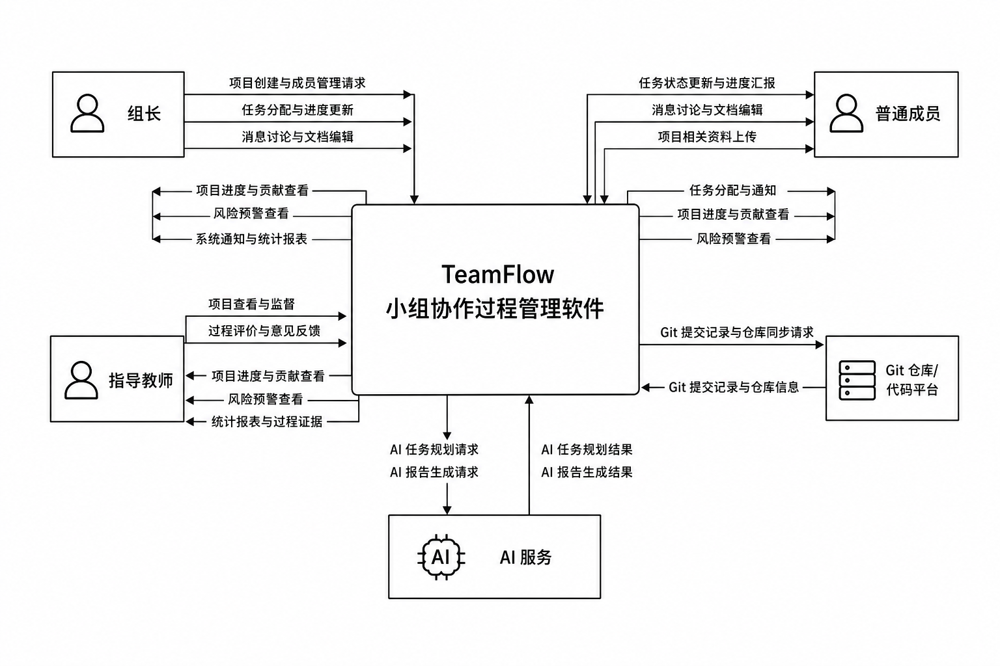

从图中可以看出，TeamFlow 处于整个课程设计协作过程的中心位置。它一方面接收来自组长和普通成员的操作请求，另一方面也将统计结果、风险提示和过程信息反馈给用户；同时，它还与外部 Git 平台和 AI 服务进行数据交换。系统环境图从宏观上说明了：本系统并不是一个孤立的单点应用，而是课程设计协作过程中的统一信息枢纽。

### 4.3 一层数据流图

一层数据流图进一步描述系统内部主要处理过程、核心数据存储和外部实体之间的数据流转关系。根据当前项目功能和业务结构，可将系统划分为六个核心处理过程：用户与项目管理、任务协同管理、消息与沟通管理、文档与文件管理、协作事件与贡献分析、风险预警与 AI 辅助。

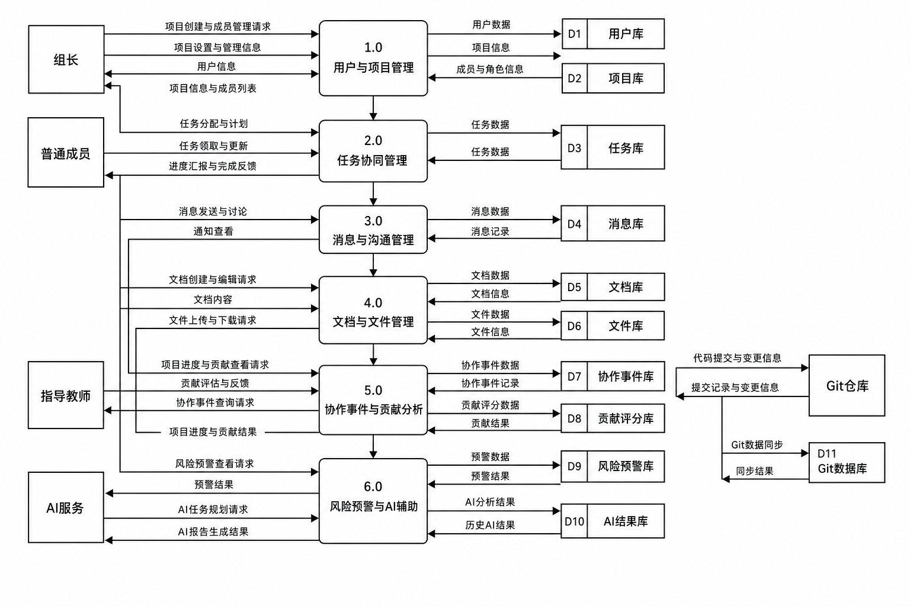

在该图中，用户库、项目库、任务库、消息库、文档库、文件库、协作事件库、贡献评分库、风险预警库、Git 数据库和 AI 结果库构成了主要数据存储。通过数据流图可以清楚看到，项目中的各种行为并不是彼此割裂的，而是围绕项目这一核心上下文持续流动。例如，任务更新会影响协作事件库和贡献评分库，文档编辑既会写入文档库，也会形成协作事件，风险扫描则依赖任务、文档、提交等多维度数据，最终向用户输出预警结果。该图展示了系统“过程数据联动”的本质特征。

### 4.4 系统结构图

系统结构图从模块分解角度描述系统的整体组成。TeamFlow 以项目空间为中心，向下细分为用户与权限模块、项目空间模块、任务管理模块、消息沟通模块、文档协作模块、文件管理模块、协作图谱模块、贡献分析模块、风险预警模块、Git 协作模块和 AI 智能辅助模块。

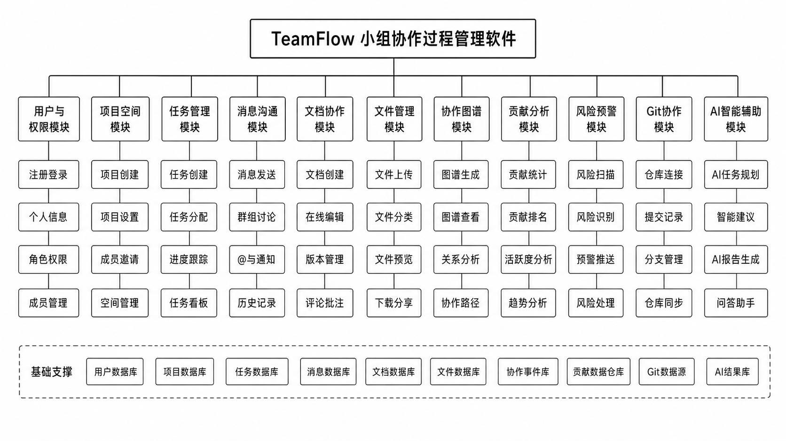

该结构图反映出本系统具有典型的层次化特征。顶层是完整系统，中间层是业务子模块，底层则是各模块的细分功能，例如任务模块可细分为任务创建、任务分配、状态更新与里程碑管理，文档模块可细分为文档创建、编辑与版本管理，AI 模块可细分为任务规划和报告生成等。系统结构图说明，本项目并非简单地堆叠若干页面，而是围绕课程设计协作过程构建了较完整的功能体系。

### 4.5 传统方法学分析结论

通过系统环境图、一层数据流图和系统结构图可以得出：TeamFlow 在传统方法学视角下具备较清晰的边界、处理逻辑和模块组织结构。它能够有效承接来自不同外部实体的协作请求，并通过内部多个业务处理过程实现项目数据的有序流转与沉淀。这为后续面向对象设计和数据库设计奠定了清晰的总体框架。

---

## 5. 面向对象分析与设计

### 5.1 面向对象方法学概述

与传统方法学重视数据流和处理过程不同，面向对象方法学更强调从参与者、对象、类及其关系出发理解系统。对于 TeamFlow 而言，系统由用户、项目、任务、文档、消息、协作事件、贡献证据、风险记录和 AI 建议等多个对象共同构成，各对象之间存在稳定的关联关系。因此，用例图、类图和顺序图能够更精确地刻画系统的对象结构和行为过程。

### 5.2 系统用例图

用例图用于描述系统参与者与功能之间的对应关系。结合当前项目需求与实现情况，系统的主要参与者包括组长、普通成员和指导教师。组长具有更强的项目管理权限，普通成员偏向执行与协作，指导教师则主要负责查看项目过程和评价参考。

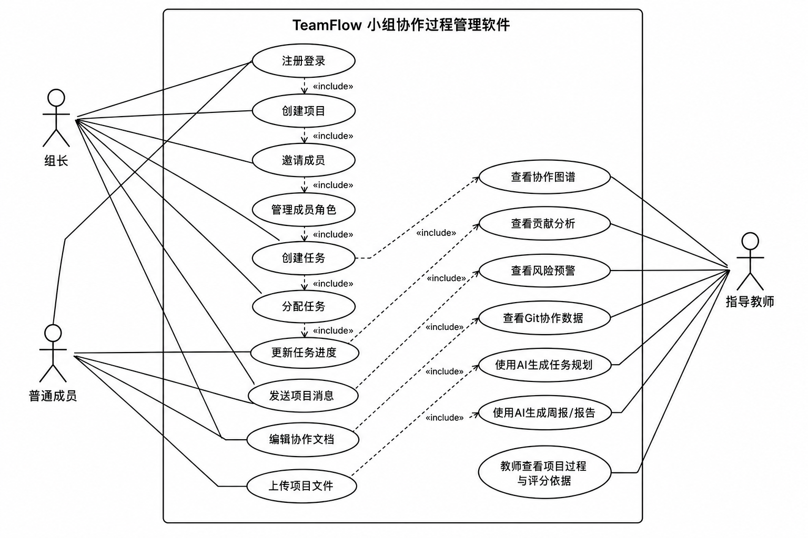

从用例图可以看出，创建项目、邀请成员、管理角色、分配任务、执行风险扫描和 AI 规划等操作主要由组长发起；普通成员则以更新任务进度、编辑文档、发送消息、上传文件和查看项目状态为主；教师更多参与查看协作图谱、贡献分析、风险状态以及评分依据。这与课程设计实际中的角色分工较为一致，也说明系统在需求设计上兼顾了团队内部管理和教师外部监督两个层面。

### 5.3 核心类图

类图用于展示系统的核心类、关键属性、主要方法以及类之间的关系。结合当前仓库中的后端数据模型，系统的核心类包括 User、Project、ProjectMember、Task、TaskDependency、Milestone、Document、DocumentVersion、Message、CollaborationEvent、ContributionScore、ContributionEvidence、RiskAlert、FileResource、GitRepository、GitCommit、AITaskSuggestion 和 AIReportHistory 等。

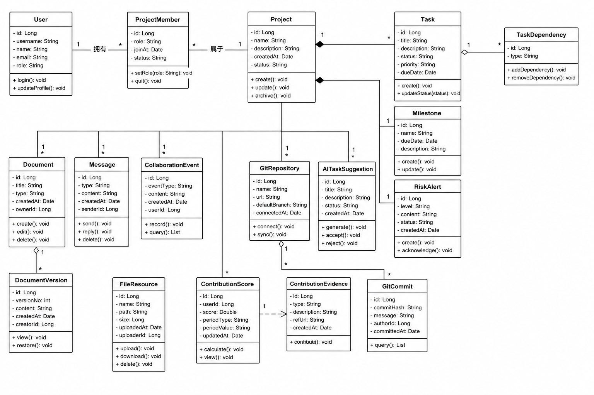

类图体现了几个关键关系。首先，User 与 Project 并非直接建立多对多关系，而是通过 ProjectMember 这一中间实体保存成员角色与加入状态，便于扩展组长、普通成员和教师等不同身份。其次，Project 作为项目上下文的核心，与 Task、Document、Message、CollaborationEvent、RiskAlert、GitRepository、AITaskSuggestion 和 AIReportHistory 等对象都存在一对多关系，说明项目是系统中的业务聚合根。再次，Document 与 DocumentVersion、GitRepository 与 GitCommit、ContributionScore 与 ContributionEvidence 等关系则体现了系统对版本沉淀、代码轨迹和过程证据的重视。

通过类图可以看出，系统的对象设计不仅覆盖了常规协作平台的基本实体，也引入了协作事件、贡献证据和 AI 建议等更贴近课程过程考核需求的对象，这也是本项目区别于普通任务管理系统的重要体现。

### 5.4 文档协作顺序图

为了进一步说明系统中的典型交互过程，本文补充给出文档协作顺序图。该顺序图描述了普通成员在文档协作场景下，从打开文档到编辑保存、形成新版本并记录协作事件的完整过程。

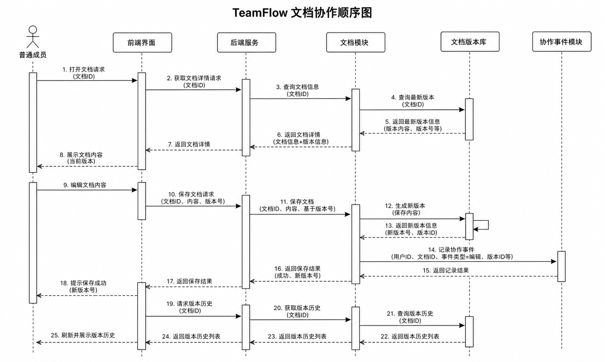

这一顺序过程说明，系统中的文档协作不是简单地覆盖原有文本，而是通过版本保存机制和事件记录机制实现过程沉淀。用户打开文档时，前端需要先向后端请求当前版本信息；编辑完成后，系统将保存新的文档版本，同时写入协作事件，以供后续贡献分析和过程回溯使用。这种设计能够较好支撑课程设计中“多人共同撰写报告”的真实需求。

### 5.5 面向对象分析结论

从用例图、类图和顺序图可以看出，TeamFlow 的面向对象设计具有较强的业务针对性和扩展性。系统围绕项目这一聚合中心，形成了稳定的对象关系网络；同时，通过版本实体、事件实体、证据实体和 AI 建议实体等扩展对象，把课程设计场景中的协作过程、过程评价和辅助决策纳入统一建模范围。这种设计思路有助于后续继续演进系统功能，而不必推翻现有结构。

---

## 6. 数据库设计

### 6.1 数据库设计原则

数据库设计是系统实现的核心基础之一。为了满足课程设计场景中“多对象、多关系、多过程数据沉淀”的需求，本系统在数据库设计时遵循了以下原则：

1. 以项目为核心组织业务数据，确保任务、消息、文档、文件和统计信息都能归属于具体项目。
2. 保持实体之间关系清晰，便于查询成员、任务、文档、风险和协作事件之间的关联。
3. 在满足功能需要的前提下尽量保留扩展字段和可演进空间，例如贡献得分、协作事件类型、AI 建议结果等。
4. 支持过程数据留痕，避免只存当前状态而不存历史痕迹。
5. 兼顾课程设计演示的简洁性与系统结构的完整性。

当前项目默认采用 SQLite 数据库，这种数据库轻量、部署简单，适合课程设计环境使用；在实际部署或扩容时，也可以根据相同模型迁移到 MySQL 等数据库中。

### 6.2 核心数据表说明

#### 6.2.1 用户相关表

`user` 表用于存储系统用户的基本信息，包括用户名、密码摘要、昵称、头像、邮箱、手机号、角色和状态等字段。该表是整个系统的基础数据表之一，几乎所有业务实体都通过外键与用户建立关系。

`project_member` 表用于维护项目与成员之间的关系，记录用户在某个项目中的角色、技能标签、加入时间和状态。采用单独的成员关系表能够灵活表达一个用户参与多个项目、一个项目拥有多个成员的情况，也便于后续扩展教师和管理员等角色。

#### 6.2.2 项目与任务相关表

`project` 表记录项目名称、项目描述、封面、项目负责人、课程名称、教师、项目起止时间和截止时间等信息，是整个系统最核心的业务实体。

`task` 表记录任务标题、任务描述、负责人、创建人、优先级、难度、状态、进度、开始时间、截止时间和完成时间等信息，用于支撑项目过程中的任务拆解与推进。

`task_dependency` 表用于表示任务之间的依赖关系，便于描述“某任务必须在另一任务完成后才能开始”这一业务逻辑。

`milestone` 表用于管理项目阶段性目标和关键时间点，帮助组长从更高层面把控项目进度。

#### 6.2.3 文档与沟通相关表

`document` 表用于记录协作文档的基本信息，如所属项目、标题、创建者、当前版本和权限等。

`document_version` 表用于记录文档每一次版本保存时的快照、版本号、变更摘要和贡献字数等信息，是支撑版本管理和文档贡献分析的关键数据表。

`message` 表用于保存项目消息内容，包含消息类型、发送者、线程信息、引用对象和质量分等字段，为即时消息与讨论功能提供数据支撑。

#### 6.2.4 过程审计与评价相关表

`collaboration_event` 表是系统的特色数据表之一，用于记录任务创建、状态更新、文档编辑、文件上传、消息发送、代码提交、评审通过等协作事件。通过 `event_type`、`target_type`、`target_id`、`branch_name`、`summary` 和 `payload` 等字段，系统可以将离散操作组织为可视化图谱。

`contribution_score` 表记录成员在某个项目中的多维贡献得分，包括任务得分、文档得分、代码得分、响应得分、稳定性得分、互评得分和总分等。

`contribution_evidence` 表记录组成贡献得分的具体证据项，例如完成某任务、保存某文档版本、提交某次代码等，使贡献分析具备可解释性。

`risk_alert` 表用于记录项目中的风险预警信息，包括风险类型、风险级别、风险分值、原因、建议和状态等，是风险雷达页面的重要数据来源。

`peer_evaluation` 表用于支持成员互评和后续评价校准，虽然当前前端表现较少，但数据库模型已经为这一扩展方向提供了支撑。

#### 6.2.5 文件、Git 与 AI 相关表

`file_resource` 表用于保存项目文件资源的元数据，包括上传者、文件名称、文件路径、文件大小和关联任务等。

`git_repository` 表用于记录项目绑定的代码仓库信息，包括仓库名、仓库地址、提供商和默认分支等字段。

`git_commit` 表用于记录项目中的提交信息，包括作者、提交哈希、提交说明、分支、改动文件、增删行数和质量分等，为代码协作展示和贡献计算提供依据。

`ai_task_suggestion` 表用于保存 AI 任务规划建议的输入与输出内容，使 AI 生成结果可复用、可确认、可追踪。

`ai_report_history` 表用于记录 AI 自动生成的项目周报或答辩报告内容，便于后续查看与导出。

### 6.3 数据库关系图

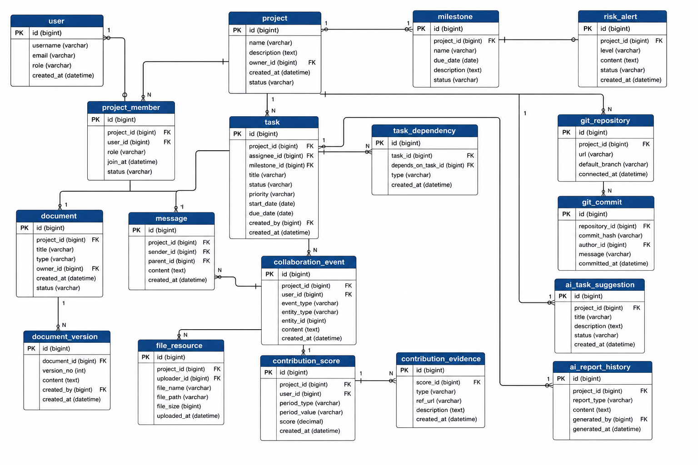

数据库关系图显示，项目是最核心的数据聚合节点。项目向下关联任务、里程碑、文档、消息、文件、协作事件、贡献评分、风险预警、Git 仓库以及 AI 建议和报告历史等多个数据对象；用户则通过项目成员关系表连接项目，同时又作为任务负责人、消息发送者、文档创建者、事件执行者、提交作者和 AI 请求发起者出现。这样的关系设计有助于围绕“项目”和“成员”两个关键维度进行多角度查询与统计。

### 6.4 数据库设计合理性分析

本系统数据库设计的一个重要特点是：不仅存储业务实体的当前状态，还存储大量过程型数据。例如任务的完成情况、文档的版本历史、协作事件节点、贡献证据明细和风险记录等。对于课程设计项目来说，这种设计远比只保存任务和用户基本信息更有价值，因为它能够支撑过程回溯、贡献分析和答辩展示。

此外，系统中的表设计既考虑了当前实现，也兼顾了未来扩展。例如贡献相关表和 AI 相关表虽然在当前项目中属于特色模块，但提前纳入数据模型可以为后续增强算法逻辑和教师评价逻辑打下基础。这种“适度前瞻”的数据库设计方式符合软件工程项目在课程训练中的综合性要求。

---

## 7. 界面设计

### 7.1 界面设计原则

界面设计是课程设计评分中的重要组成部分。对于本系统而言，界面不仅要“能看”，更要与系统功能、角色需求和软件工程场景相匹配。因此，TeamFlow 的界面设计遵循以下原则：

1. 结构清晰。采用典型的中后台管理布局，方便承载大量功能模块。
2. 风格统一。颜色以蓝灰和低饱和科技感为主，突出专业性和系统化。
3. 信息优先。重点展示任务状态、统计指标、风险预警和协作过程信息。
4. 功能导向。每个页面都围绕具体业务目标设计，而不是单纯追求视觉效果。
5. 适合答辩展示。仪表盘、图谱、风险页等页面都具备较强可展示性。

### 7.2 登录页设计

登录页是用户进入系统的第一入口，应突出系统名称、系统定位和基础登录能力。页面设计应简洁明了，避免过多装饰元素，重点保证账号输入、密码输入和登录按钮清晰可见。

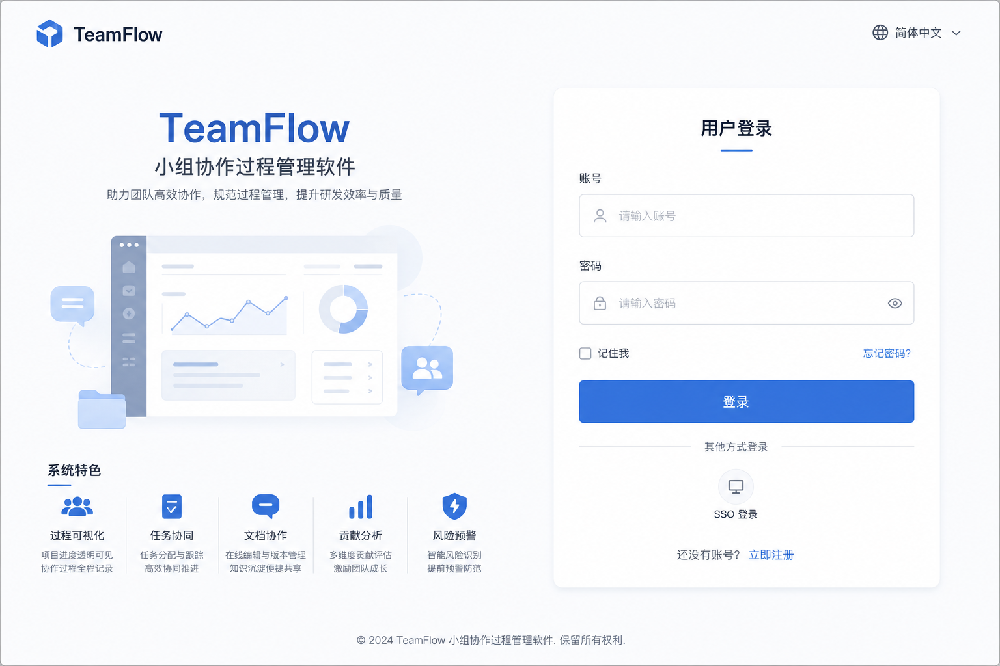

该界面采用浅色背景和居中登录卡片布局，一方面符合中后台系统的常见交互习惯，另一方面也有利于降低用户理解成本。系统名称和副标题直接体现了“课设协作管理”的产品定位。

### 7.3 项目列表页设计

项目列表页用于展示用户参与的所有项目，并支持快速创建新项目或进入已有项目。该页面需要兼顾信息概览和项目切换效率。

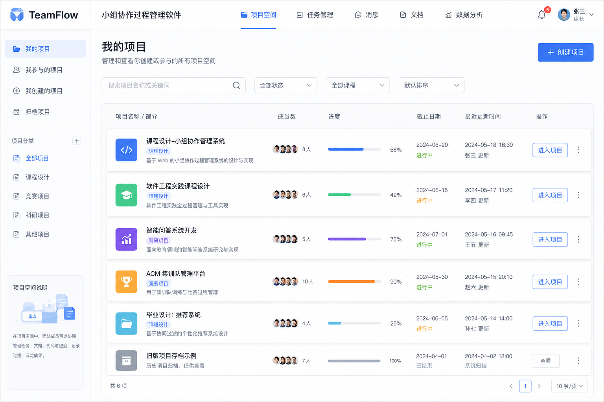

在设计上，项目列表通常采用卡片或表格形式展示项目名称、简介、成员数、当前进度、截止时间和更新时间等关键信息。对于课程设计场景而言，这种展示方式能够帮助学生快速定位不同课程项目，也便于答辩时展示系统的项目空间组织方式。

### 7.4 项目仪表盘页设计

仪表盘页是系统展示综合信息的核心页面，也是最适合在答辩中展示的页面之一。它需要集成任务完成率、在制任务数、延期任务数、成员数量、文档数量、协作事件数量，以及项目活跃度趋势、最新事件、风险提示和成员贡献排名等内容。

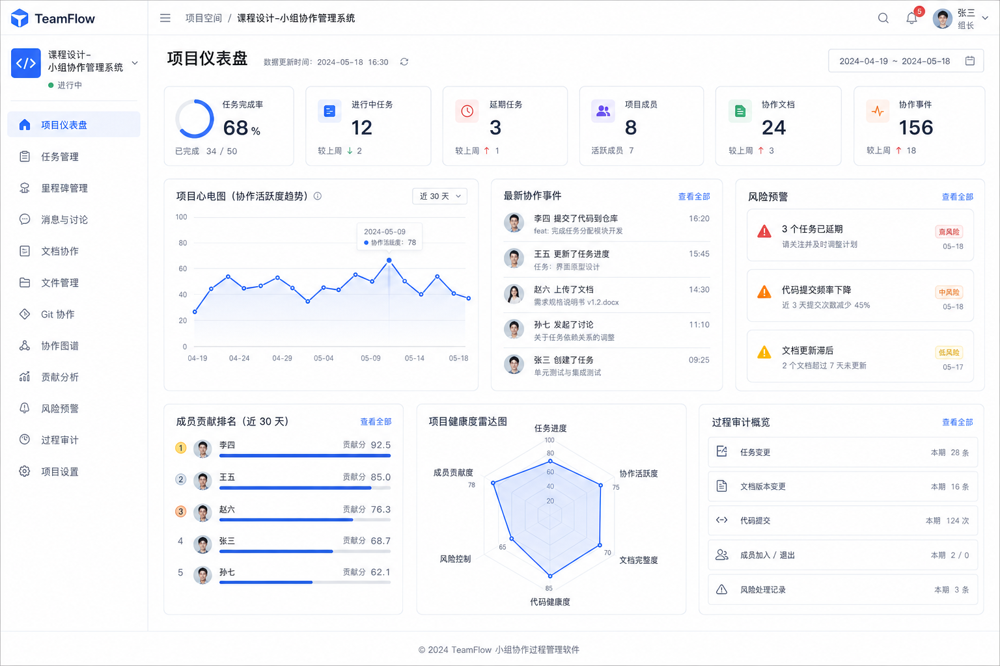

该页面从视觉上强调“数据驱动的项目管理”，通过统计卡片、折线图、雷达图和列表卡片形成多层次信息结构。对于组长而言，仪表盘是项目总览入口；对于教师而言，它能够在较短时间内反映项目推进状态和团队活跃度，因此具有较强的管理和展示价值。

### 7.5 任务管理页设计

任务管理页是团队成员日常使用频率最高的页面之一。任务在课程设计场景下不仅是工作安排单元，也是过程考核的重要依据，因此页面应突出状态流转、负责人、优先级、截止时间和进度等核心信息。

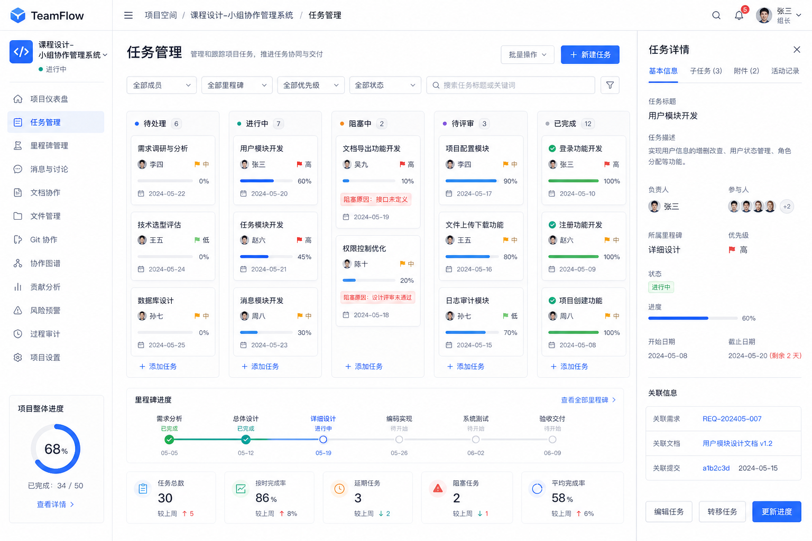

当前设计采用看板式布局，将任务按照待处理、进行中、阻塞中、待评审和已完成等状态分列展示。这种设计直观反映了任务推进阶段，也方便通过拖拽或点击方式完成状态更新。对组长来说，它有利于掌握项目卡点；对成员来说，它有利于明确个人任务归属。

### 7.6 文档协作页设计

课程设计报告、需求说明、数据库设计和测试说明等内容都需要通过文档沉淀，因此文档协作页的设计非常重要。页面通常由文档目录、编辑区域和版本/评论区域构成。

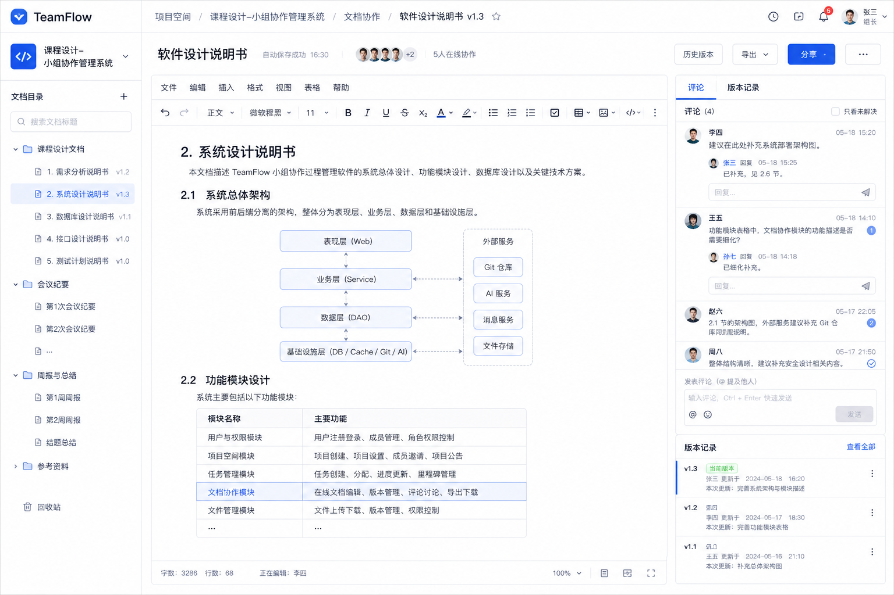

这种布局一方面便于用户快速在多个文档之间切换，另一方面也能在编辑过程中随时查看版本历史或讨论内容。由于课程设计报告通常需要多人协同完成，文档协作页的存在可以很好地体现本系统相较于普通任务平台的差异化价值。

### 7.7 协作图谱与贡献分析页设计

协作图谱与贡献分析页是 TeamFlow 的特色页面之一，它将项目过程数据从抽象列表转化为可视化事件网络，并结合成员得分与证据链展示过程性成果。

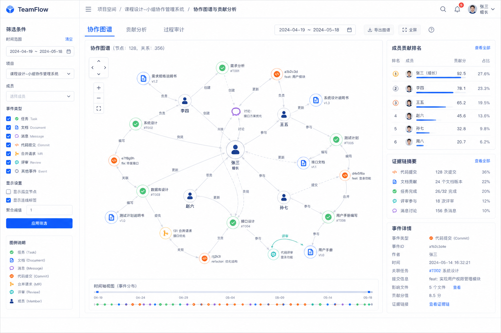

页面中央的大图谱区域用于展示协作事件节点和连线，左侧筛选栏便于按成员或时间筛选，右侧则展示节点详情或成员贡献摘要。这种界面既具备较强的软件工程特色，也非常适合在课程汇报时说明“本系统如何记录并分析协作过程”。

### 7.8 AI 助手页设计

AI 助手页体现了系统从传统协作工具向智能协作平台升级的方向。页面需要支持输入项目信息、展示 AI 规划结果、里程碑建议、风险提示和项目周报等内容。

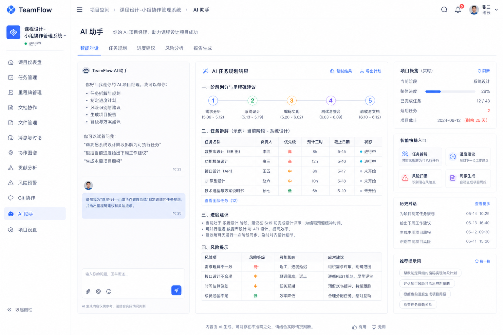

该页面的意义不只是展示 AI 对话能力，而是突出 AI 在课程设计管理中的具体作用，例如帮助组长拆任务、安排里程碑和形成阶段性总结。对于答辩展示而言，这也是系统创新点的重要体现。

### 7.9 界面设计总结

从整体上看，TeamFlow 的界面设计保持了统一的中后台风格，并围绕课程设计的核心协作场景组织页面。界面既覆盖了登录、项目、任务、文档等基础模块，也通过仪表盘、协作图谱、贡献分析和 AI 助手等页面突出系统特色。这种设计既符合评分标准中对“页面数量”和“设计工作量”的要求，也能较好支持项目演示与课程答辩。

---

## 8. 系统实现概述

### 8.1 总体架构设计

TeamFlow 采用前后端分离架构。前端主要负责用户交互、页面跳转、数据可视化和操作反馈；后端负责业务逻辑处理、数据持久化、权限校验和接口提供；数据库负责存储业务实体和过程数据；AI 接口用于生成规划建议和报告内容。整体结构清晰，符合现代 Web 应用开发方式。

从项目仓库结构来看，前端代码集中在 `frontend/` 目录下，后端代码集中在 `backend/` 目录下。前端使用 Vue Router 管理登录页、注册页、项目列表页以及项目空间下的多个子页面；后端通过不同 API 模块分别处理认证、项目、任务、消息、文档、协作统计和 AI 服务等业务。这样的分层方式有利于团队成员分工，例如前端成员主要负责页面与状态管理，后端成员主要负责接口与模型设计，文档成员则可结合系统结构编写报告。

### 8.2 前端实现概述

前端部分基于 Vue 3 与 TypeScript 构建，项目通过 `createWebHistory` 组织路由，已实现登录、注册、项目列表和项目内多模块页面。项目空间内部页面包括仪表盘、任务看板、即时消息、文档列表、文档编辑、文件管理、协作图谱、贡献分析、风险预警、Git 协作、AI 页面和项目设置，说明系统在页面层面已经形成较完整的协作闭环。

在页面风格上，系统大量使用卡片布局、统计卡片、图表组件和抽屉/弹窗交互，使中后台信息展示更加清晰。以仪表盘为例，前端通过 ECharts 生成项目活跃度折线图和健康雷达图，通过列表组件展示最新协作事件、风险预警和成员贡献排名，实现了较高的信息密度和较好的视觉组织效果。Graph 页面则结合图谱渲染能力展示协作事件网络，使系统不仅能“管理数据”，还能“讲述过程”。

### 8.3 后端实现概述

后端采用 FastAPI 开发，系统启动时通过 `Base.metadata.create_all` 初始化数据表，路由统一挂载在 `/api` 路径下。认证模块提供用户注册、登录、个人信息查看与修改、密码修改和用户搜索接口；项目模块负责项目创建、查询、修改、成员管理和仪表盘统计；任务模块负责任务与里程碑管理；消息模块负责消息查询、发送、删除以及 WebSocket 实时通信；文档模块负责文档、版本和文件管理；协作模块负责图谱、贡献、风险、Git 提交与互评相关业务；AI 模块负责任务规划与周报生成。

从设计角度看，后端的亮点之一在于围绕协作事件、贡献得分和风险记录建立了独立的数据层，这使得系统不再只是一套简单 CRUD 接口，而是具备过程审计和统计分析能力。例如，任务创建和任务状态更新会触发协作事件写入；贡献重算会结合任务完成、文档新增字数和代码提交等多维度数据；风险扫描则会根据任务逾期、活跃度等因素产生告警记录。这些设计都体现出项目对“过程数据”的重视。

### 8.4 AI 功能实现概述

AI 功能是本系统的重要创新点之一。当前后端通过 `ai_service.py` 提供规划生成、规划确认和项目周报生成能力。在有可用 AI API Key 时，系统可将用户输入发送给大模型获取结果；在没有外部 AI 能力的情况下，系统也提供模板回退方案，确保课程设计演示的稳定性。这种设计充分考虑了学生项目在资源条件上的不确定性。

前端 AI 页面则提供了项目名称、成员角色、截止日期和技术栈等输入项，并将 AI 规划结果以里程碑、任务列表和风险提示等形式展示。这种页面设计能够让 AI 输出更贴近项目管理，而不是仅仅呈现一个聊天窗口，从产品定位上更符合“AI 项目经理”的概念。

### 8.5 安全与权限控制实现概述

虽然本项目主要服务于课程设计场景，但在系统实现中仍然体现了基本的安全意识。用户密码采用哈希存储；用户登录后通过 JWT 获得访问令牌；后端多数接口在访问前都要校验当前用户是否属于目标项目；涉及成员邀请、项目修改、项目归档、AI 规划确认和里程碑创建等操作时，还增加了角色权限检查。这样的实现虽然相对基础，但足以支撑课程项目的正常使用，也体现了软件工程设计中“权限最小化”的原则。

### 8.6 已实现内容与扩展设计区分

为了保证报告真实性，需要对系统“已实现内容”和“扩展设计内容”进行区分。

已实现或已具备清晰代码支撑的内容包括：用户认证、项目空间管理、任务看板、里程碑、即时消息、WebSocket 通信、文档与版本管理、文件管理、仪表盘统计、协作图谱基础展示、贡献分计算、风险扫描、Git 提交记录、AI 规划与周报生成等。

作为设计文档中的扩展方向、但当前代码实现尚不完全的内容包括：更完整的教师专属视图、复杂的代码冲突预测逻辑、细粒度文档权限分级、多人实时光标协同、自动化 PR 流程跟踪、更高精度的互评校准算法、更成熟的甘特图排期与报告导出能力等。将这些内容作为未来扩展进行说明，既能体现系统创新空间，也避免了与现有代码事实不一致。

---

## 9. 系统创新点分析

### 9.1 协作过程可视化创新

与普通课程管理工具不同，TeamFlow 将项目中的任务、消息、文档和代码行为转化为协作事件，并通过图谱方式可视化。这种设计让团队协作不再停留在静态表单，而能够以“事件链”的方式呈现过程脉络，极大增强了系统的展示力和解释力。

### 9.2 贡献证据链创新

传统小组项目往往只统计“做了多少”，却很少解释“为什么这样算”。本系统设计了贡献得分与贡献证据两类实体，使每一项得分都可以追溯到任务完成、文档版本或代码提交等具体行为，从而让过程评价更透明、更公平。

### 9.3 风险预警机制创新

课程设计中“前期拖延、后期突击”是极其常见的现象。TeamFlow 通过任务状态、活跃度和协作行为分析项目风险，并以风险雷达和预警列表的方式提醒组长和成员及时调整。这种能力使系统从被动记录工具升级为主动管理工具。

### 9.4 AI 项目经理创新

本系统没有把 AI 简单做成聊天入口，而是让 AI 直接服务于任务拆解、里程碑规划、风险提示和周报生成等项目管理活动。对课程设计而言，这一功能具有很强的现实帮助作用，也提升了系统的创新表达。

### 9.5 教学过程适配创新

系统设计从一开始就面向高校课程设计场景，而不是从通用企业平台简单裁剪，因此它在功能命名、角色划分、页面结构、数据沉淀方式和答辩友好性方面都更适合教学使用。这种“场景定制化”本身也是本项目的重要特色。

---

## 10. 结论与展望

### 10.1 结论

本文围绕“基于 AI 驱动协作过程审计的小组协作过程管理软件”这一主题，结合当前仓库中的 TeamFlow 项目，对系统进行了较为完整的软件工程分析、设计与实现说明。报告严格依据课程要求，从可行性分析、需求分析、传统方法学建模、面向对象建模、数据库设计、界面设计和系统实现概述等方面展开，形成了比较完整的课程设计文档体系。

从功能上看，TeamFlow 已经具备较完整的小组协作管理能力。它不仅支持用户登录、项目管理、任务推进、消息讨论、文档协作和文件管理等基础功能，还通过仪表盘、协作图谱、贡献分析、风险扫描、Git 记录和 AI 规划等模块，体现出较强的软件工程特色和教学适配性。特别是在“协作过程留痕、成员贡献可解释、项目风险可预警、AI 辅助可落地”这几个方面，系统形成了相对清晰的产品思路和实现路径。

从方法学角度看，传统方法学帮助我们从系统边界、数据流和结构分解层面理解系统整体；面向对象方法学则帮助我们从参与者、类结构和交互顺序层面理解系统内部逻辑。两种方法相互补充，不仅满足了课程设计要求，也让系统分析更加完整。

总体而言，本项目达到了软件工程课程设计“完成相关主题的系统分析、设计与实现”的基本目标，并在过程管理、可视化展示和 AI 辅助方面体现出一定创新性和实践价值。

### 10.2 存在的不足

尽管系统已经具备较完整的框架与核心功能，但仍存在一些不足。

第一，部分扩展功能还停留在设计和基础数据结构层面，例如更复杂的教师评分辅助、更完善的 Git 冲突预测、更加细粒度的权限体系和真正的多人实时协同编辑体验等，仍需后续继续完善。

第二，当前数据库默认使用 SQLite，适合课程设计开发与演示，但在更大规模的并发和更复杂的部署环境中还需要考虑迁移到更成熟的数据库方案。

第三，当前前端虽然已经有较多页面，但教师视角和管理员视角的独立页面还不够完整，未来可以继续围绕课程过程评价场景进行加强。

第四，AI 模块目前主要聚焦任务规划与周报生成，未来还可以向需求摘要、测试建议、风险解释、答辩脚本生成和报告润色等方向进一步拓展。

### 10.3 未来展望

未来，TeamFlow 可以从以下几个方向继续演进。

1. 增强教师端能力，形成独立的教学过程管理视图与评分参考面板。
2. 加强 Git 深度集成，支持更真实的仓库同步、PR 状态与冲突风险识别。
3. 增强文档协同体验，支持评论、批注、实时协同和更完善的导出能力。
4. 优化贡献算法，引入更加细致的权重配置和异常行为识别机制。
5. 拓展 AI 能力，使其从“给建议”进一步升级为“辅助管理和辅助答辩”的综合智能助手。
6. 提供更丰富的报告输出能力，帮助学生自动生成阶段性材料、答辩说明和教师评价参考。

可以预见，随着课程过程化考核趋势的加强，类似 TeamFlow 这样的面向教学协作场景的系统将具备越来越强的应用价值。它既是一个课程设计项目，也可以成为今后进一步深入开发的基础平台。

---

## 11. 创新点总结

为了便于课程汇报，现将本系统的创新点归纳如下：

1. 系统聚焦高校课程设计场景，选题贴合教学实际，问题导向明确。
2. 在常规协作平台基础上引入协作图谱，使过程信息从列表变为可视化网络。
3. 引入贡献得分与证据链机制，增强成员贡献评价的公平性和可解释性。
4. 引入风险扫描和风险雷达，提高团队管理的主动性。
5. 将 AI 功能具体落在任务规划和周报生成等项目管理环节，实用性较强。
6. 采用前后端分离和模块化设计，具备较好的可维护性和扩展空间。

这些创新点使得 TeamFlow 不只是一个“能管理任务”的系统，而是一个面向课程设计全过程的协作管理与过程审计平台。

---

## 12. 参考图片索引

为便于排版与查阅，本文插入的主要图片如下：

1. 系统环境图：`img/系统环境图.png`
2. 一层数据流图：`img/一层数据流图.png`
3. 系统结构图：`img/系统结构图.png`
4. 用例图：`img/用例图.png`
5. 类图：`img/类图.png`
6. 文档协作顺序图：`img/文档协作顺序图.png`
7. 数据库关系图：`img/数据库关系图.png`
8. 登录页：`img/登录页.png`
9. 项目列表页：`img/项目列表页.png`
10. 项目仪表盘页：`img/项目仪表盘页.png`
11. 任务管理页：`img/任务管理页.png`
12. 文档协作页：`img/文档协作页.png`
13. 协作图谱贡献分析页：`img/协作图谱贡献分析页.png`
14. AI 助手页：`img/AI助手页.png`

---

## 13. 结尾备注

1. 本报告根据当前项目仓库实际代码、页面结构、数据模型和开发文档整理撰写。
2. 文中涉及的部分高级功能，如更复杂的教师评价、深度 Git 冲突分析和更完整的实时协同，已在设计层面体现，但当前实现程度仍可继续增强。
3. 若最终提交纸质版或 Word 版报告，可进一步补充封面、目录、页码、图号编号以及组内排名和分差说明，以符合课程最终排版规范。
